# MinerBot 系统架构文档

## 1. 项目概述

### 1.1 项目简介

MinerBot 是一个基于 LangChain DeepAgents 构建的 AI 助手应用，提供交互式 REPL（Read-Eval-Print Loop）命令行界面，支持多种 LLM Provider 的灵活切换。系统具备完整的记忆能力，包括短期记忆（对话历史持久化）和长期记忆（跨会话消息存储）。

### 1.2 技术栈

| 类别 | 技术/库 | 版本要求 |
|------|---------|----------|
| **核心框架** | langchain-core | >=0.3.0 |
| **LLM 集成** | langchain-anthropic | >=0.3.0 |
| **Agent 框架** | deepagents | >=0.4.7 |
| **配置管理** | pyyaml | >=6.0 |
| **Python 版本** | Python | >=3.11 |
| **记忆存储** | 文件系统 (Markdown) | 内置 |

---

## 2. 系统架构总览

### 2.1 整体架构图

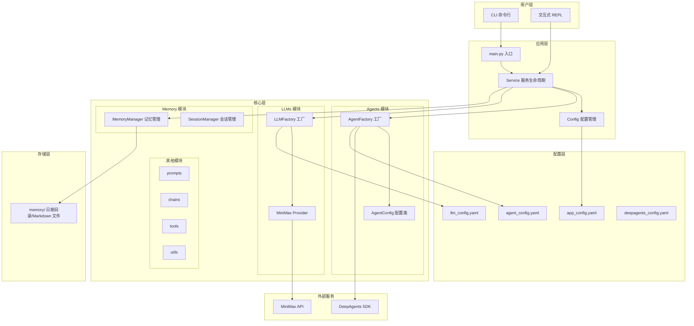

### 2.2 模块职责

| 模块 | 职责 | 关键类 |
|------|------|--------|
| `src/main.py` | 程序入口，CLI 参数解析 | `main()`, `async_main()` |
| `src/app/service.py` | 服务生命周期管理、记忆集成 | `Service` |
| `src/app/repl.py` | 交互式命令行界面 | `REPL` |
| `src/app/config.py` | 配置加载与管理 | `Config` (单例) |
| `src/agents/agent_factory.py` | Agent 实例创建与缓存 | `AgentFactory`, `get_agent()` |
| `src/agents/config.py` | Agent 配置数据类 | `AgentConfig` |
| `src/llms/factory.py` | LLM Provider 工厂 | `LLMFactory`, `get_llm()` |
| `src/llms/providers/minimax.py` | MiniMax Provider 实现 | `MiniMaxProvider` |
| `src/memory/manager.py` | 长期记忆管理、消息持久化 | `MemoryManager` |
| `src/memory/session.py` | 会话生命周期管理 | `Session`, `SessionManager` |

---

## 3. 核心模块详解

### 3.1 应用层 (src/app/)

#### 3.1.1 Service 服务类

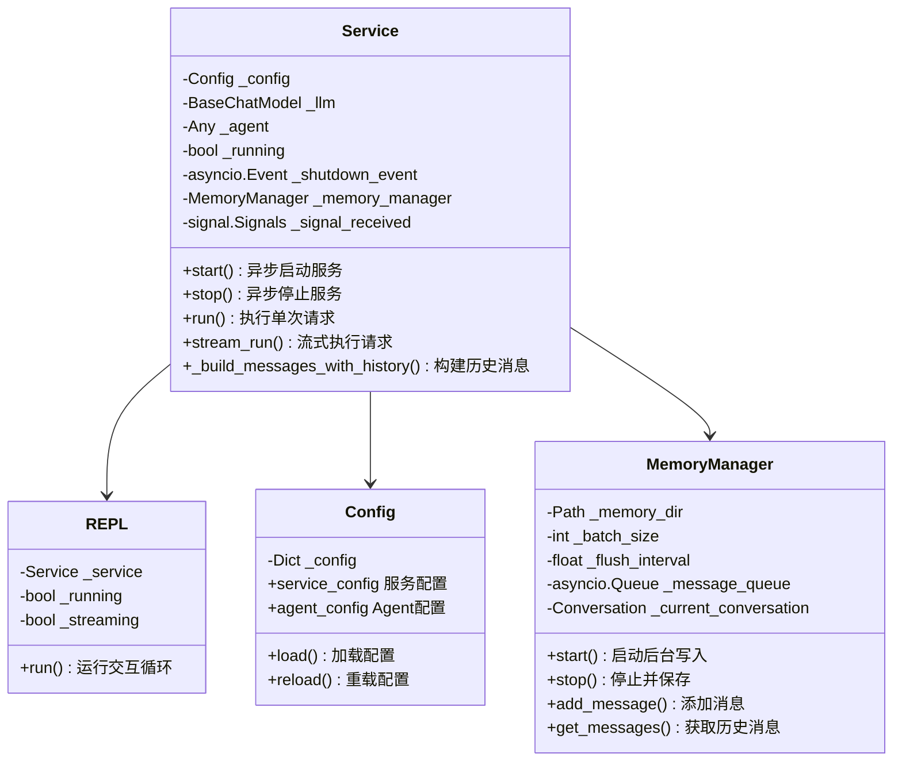

**核心功能：**
- `start()`: 初始化 LLM 和 Agent 实例
- `stop()`: 优雅停止，清理资源
- `run()`: 同步执行 LLM 请求
- `stream_run()`: 流式执行（打字机效果）
- `_build_messages_with_history()`: 从长期记忆构建完整消息列表

#### 3.1.2 REPL 交互界面

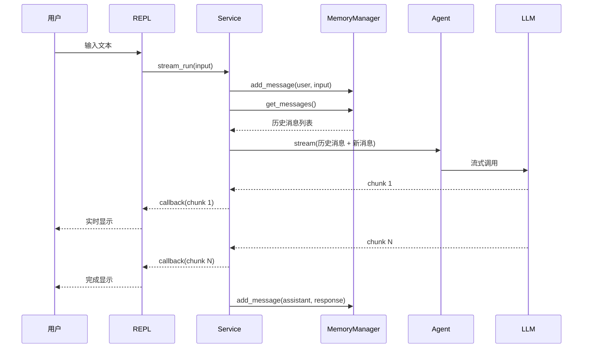

### 3.2 Agent 层 (src/agents/)

#### 3.2.1 AgentFactory 工厂模式

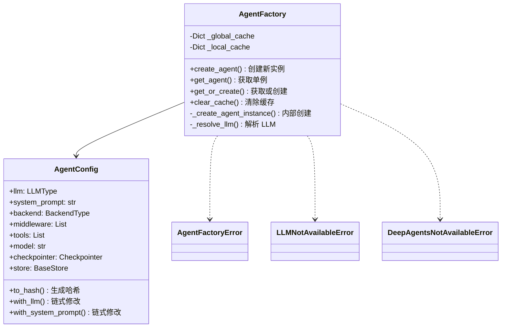

**单例模式规则：**
- 相同 `llm` + `system_prompt` → 返回同一实例
- 缓存键基于配置的 SHA256 哈希值

#### 3.2.2 Agent 创建流程

```mermaid
flowchart TD
    A[get_agent 调用] --> B{配置已缓存?}
    B -->|是| C[返回缓存实例]
    B -->|否| D[解析 LLM]
    D --> E{llm 参数类型}
    E -->|None| F[调用 src.llms.get_llm]
    E -->|str| G[调用 src.llms.get_llm(provider)]
    E -->|BaseChatModel| H[直接使用]
    F --> I[获取 LLM 实例]
    G --> I
    H --> I
    I --> J[调用 DeepAgents create_deep_agent]
    J --> K[返回 Agent 实例]
    K --> L[缓存实例]
    C --> M[返回结果]
    L --> M
```

### 3.3 LLM 层 (src/llms/)

#### 3.3.1 LLMFactory 工厂架构

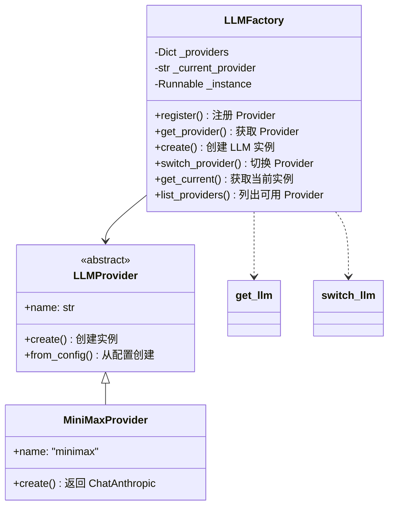

#### 3.3.2 支持的 Provider

| Provider | 状态 | 实现 | API 兼容 |
|----------|------|------|----------|
| MiniMax | ✅ 已实现 | `MiniMaxProvider` | Anthropic 兼容 |
| OpenAI | 🔄 预留 | - | OpenAI v1 |
| Anthropic | 🔄 预留 | - | Anthropic |
| Azure OpenAI | 🔄 预留 | - | Azure |

### 3.4 Memory 层 (src/memory/)

#### 3.4.1 MemoryManager 长期记忆管理

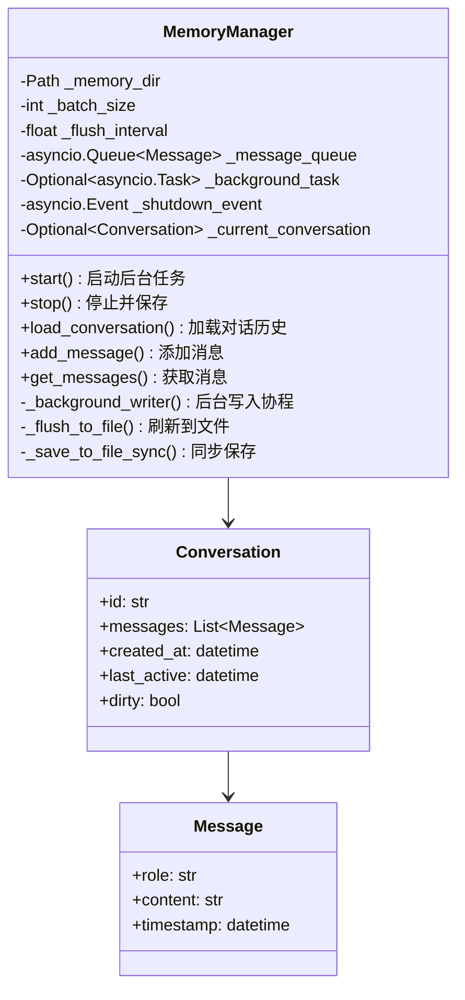

**核心特性：**
- 后台异步批量写入策略
- 消息先添加到内存缓冲区，达到批量阈值或定时触发时写入文件
- 程序退出时强制保存（atexit 钩子）
- Markdown 格式持久化

#### 3.4.2 记忆存储结构

```
memory/
└── 2026-03-13/
    ├── conversation_default.md
    └── conversation_{id}.md
```

**Markdown 文件格式：**
```markdown
# 对话记录

- **创建时间**: 2026-03-13 19:30:00
- **最后活跃**: 2026-03-13 20:45:00
- **消息数量**: 10

---

## 对话历史

### 用户 (2026-03-13 19:30:00)

你好，请帮我介绍一下 MinerBot

### 助手 (2026-03-13 19:30:05)

MinerBot 是一个基于 LangChain DeepAgents 构建的 AI 助手...
```

#### 3.4.3 SessionManager 会话管理

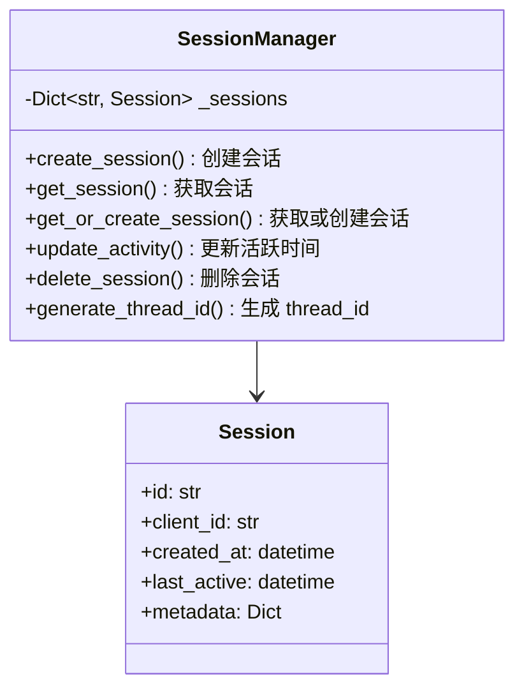

---

## 4. 数据流

### 4.1 完整请求流程（含记忆）

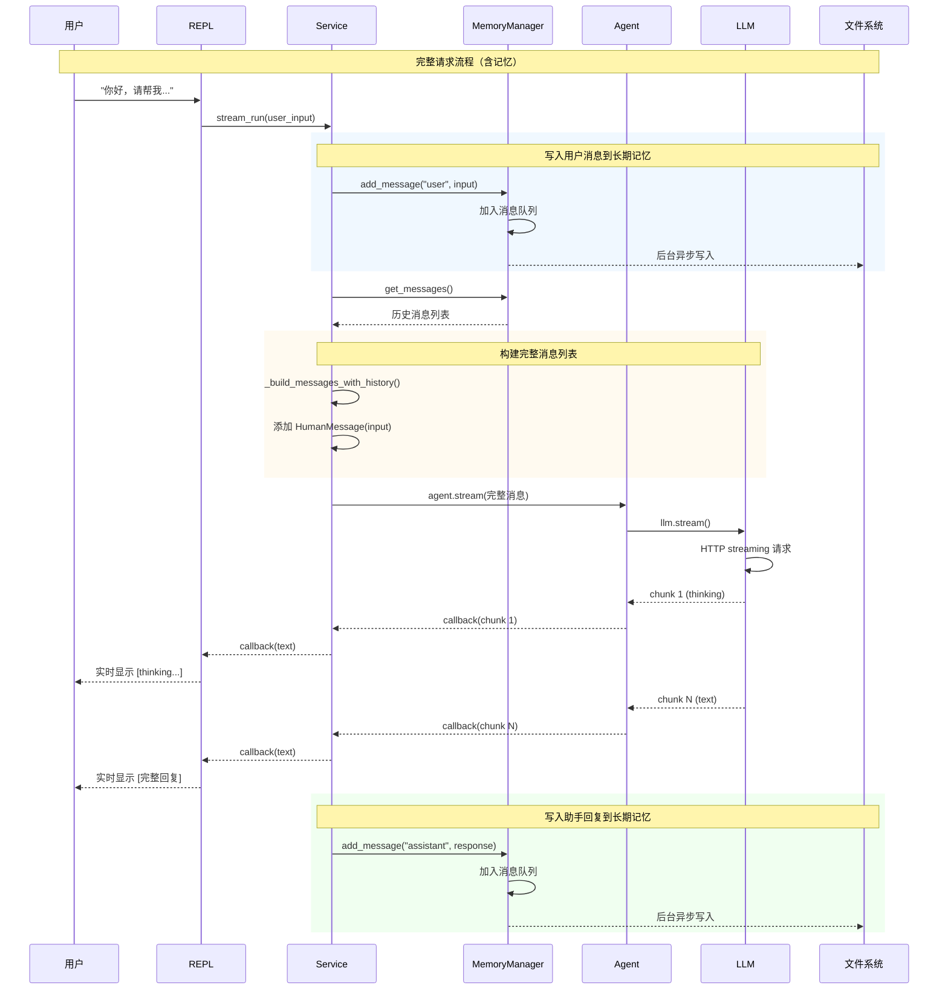

### 4.2 流式响应处理

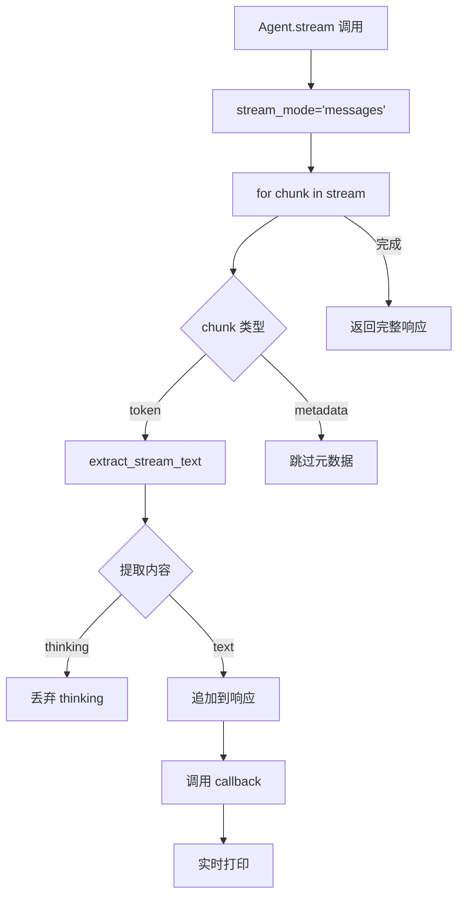

---

## 5. 配置系统

### 5.1 配置文件结构

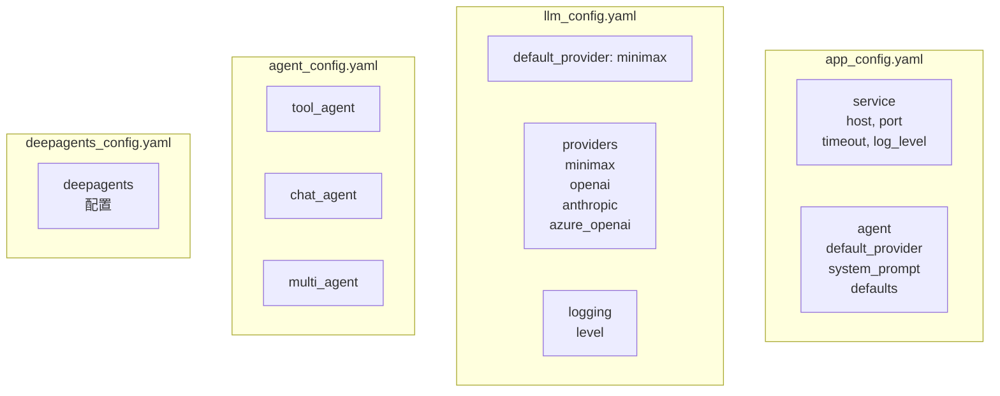

### 5.2 配置加载顺序

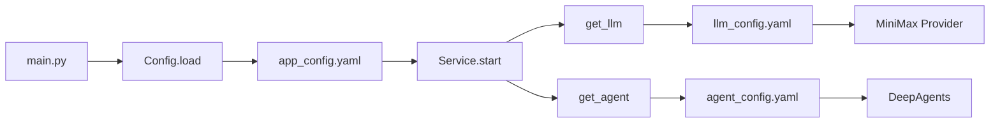

---

## 6. 异常处理

### 6.1 异常层次结构

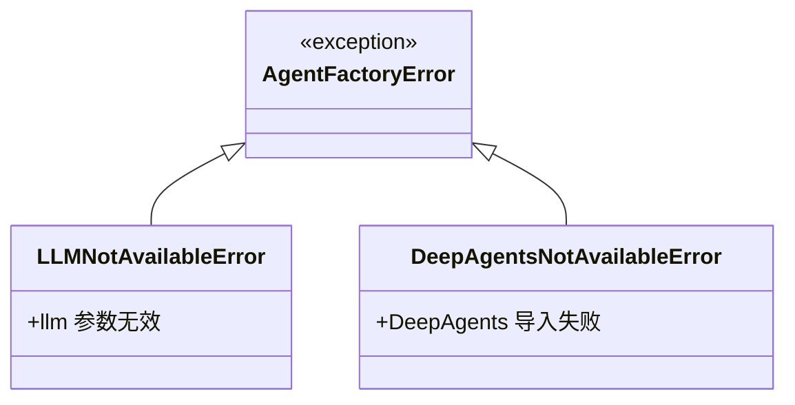

### 6.2 服务错误处理

| 错误类型 | 来源 | 处理方式 |
|----------|------|----------|
| `FileNotFoundError` | 配置文件 | 退出并提示 |
| `ValueError` | 配置验证 | 退出并提示 |
| `asyncio.TimeoutError` | LLM 请求 | 超时提示 |
| `RuntimeError` | 服务状态 | 异常抛出 |
| `KeyboardInterrupt` | 用户中断 | 优雅退出 |

---

## 7. 运行模式

### 7.1 启动流程

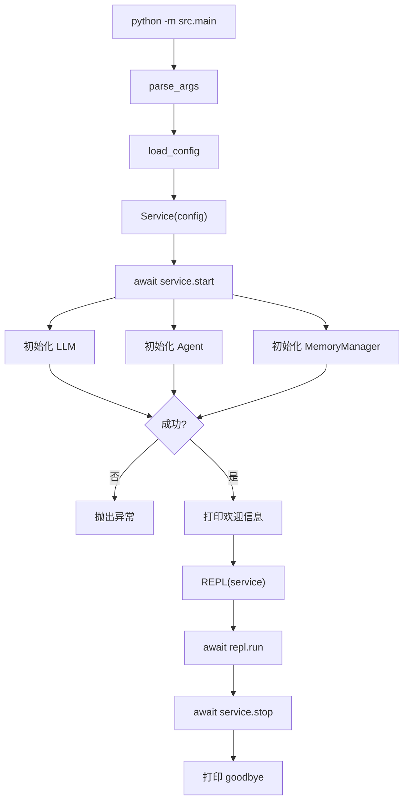

### 7.2 REPL 交互命令

| 命令 | 说明 |
|------|------|
| `<文本>` | 发送消息给 AI |
| `exit` / `quit` | 退出程序 |
| 空输入 | 跳过 |

---

## 8. 文件结构

```
minerbot/
├── src/
│   ├── __init__.py
│   ├── main.py                    # 程序入口
│   ├── app/                       # 应用层
│   │   ├── __init__.py
│   │   ├── config.py              # 配置加载
│   │   ├── service.py             # 服务生命周期（含记忆集成）
│   │   └── repl.py                # 交互界面
│   ├── agents/                    # Agent 层
│   │   ├── __init__.py
│   │   ├── agent_factory.py       # Agent 工厂
│   │   └── config.py              # Agent 配置
│   ├── llms/                      # LLM 层
│   │   ├── __init__.py
│   │   ├── factory.py             # LLM 工厂
│   │   ├── config.py              # LLM 配置
│   │   └── providers/
│   │       ├── __init__.py
│   │       └── minimax.py         # MiniMax Provider
│   ├── memory/                    # 记忆层（新增）
│   │   ├── __init__.py
│   │   ├── manager.py             # 长期记忆管理
│   │   └── session.py             # 会话管理
│   ├── prompts/                   # 提示词（预留）
│   ├── chains/                    # 链（预留）
│   ├── tools/                     # 工具（预留）
│   └── utils/                     # 工具类（预留）
├── config/
│   ├── app_config.yaml            # 应用配置
│   ├── llm_config.yaml           # LLM 配置
│   ├── agent_config.yaml         # Agent 配置
│   └── deepagents_config.yaml    # DeepAgents 配置
├── tests/
│   ├── __init__.py
│   ├── test_factory.py
│   ├── test_minimax.py
│   ├── test_streaming.py
│   ├── test_deepagents.py
│   ├── test_long_term_memory.py  # 长期记忆测试
│   ├── test_short_term_memory.py # 短期记忆测试
│   └── test_service_tdd.py       # Service TDD 测试
├── memory/                        # 记忆存储目录（运行时生成）
│   └── 2026-03-13/
│       └── conversation_default.md
├── docs/                          # 文档
│   ├── architecture.md            # 本文档
│   ├── memory-design.md           # 记忆系统设计
│   ├── gateway-design.md
│   ├── deepagents-research.md
│   └── ...
├── pyproject.toml                 # 项目配置
├── README.md                      # 项目说明
└── .env                          # 环境变量
```

---

## 9. 扩展指南

### 9.1 添加新 LLM Provider

```python
# 1. 在 src/llms/providers/ 创建新文件
# 2. 继承 LLMProvider 基类
from src.llms.factory import LLMProvider

class NewProvider(LLMProvider):
    @property
    def name(self) -> str:
        return "newprovider"
    
    def create(self, **kwargs) -> BaseChatModel:
        # 实现创建逻辑
        return ChatOpenAI(...)
    
    @classmethod
    def from_config(cls, provider_config: Dict) -> "LLMProvider":
        return cls(...)

# 3. 在 src/llms/__init__.py 或 factory.py 中注册
LLMFactory.register("newprovider", NewProvider)
```

### 9.2 添加新 Agent 类型

```python
# 在 src/agents/agent_factory.py 中扩展
def _create_agent_instance(self, config: AgentConfig) -> AgentType:
    # 根据 config 添加新的 agent 创建逻辑
    if config.agent_type == "custom":
        return create_custom_agent(...)
    # ... 现有逻辑
```

---

## 10. 新增功能说明

### 10.1 记忆系统（2026-03 新增）

**主要新增组件：**

1. **MemoryManager** (`src/memory/manager.py`)
   - 长期记忆管理
   - 后台异步批量写入
   - Markdown 格式持久化
   - 按日期组织存储

2. **SessionManager** (`src/memory/session.py`)
   - 会话生命周期管理
   - client_id 到会话的映射
   - thread_id 生成

3. **Service 层集成**
   - `_memory_manager` 属性
   - `_build_messages_with_history()` 方法
   - 自动历史消息构建

### 10.2 Service 层增强

**新增属性：**
- `_memory_manager`: 记忆管理器实例
- `_signal_received`: 收到的关闭信号

**新增方法：**
- `_init_memory_manager()`: 初始化记忆管理器
- `_build_messages_with_history()`: 构建含历史的消息列表
- `get_shutdown_signal()`: 获取关闭信号

---

## 11. 总结

MinerBot 采用分层架构设计，核心组件包括：

1. **应用层**: 提供 CLI 和 REPL 交互界面
2. **Agent 层**: 基于 DeepAgents SDK 的 Agent 工厂，支持单例缓存
3. **LLM 层**: 统一的 Provider 工厂，支持多种 LLM 服务商
4. **Memory 层**: 长期记忆管理，支持异步批量写入和 Markdown 持久化
5. **配置层**: YAML 配置文件驱动

系统设计遵循：
- **单例模式**: AgentFactory、Config 和 LLMFactory 使用单例
- **工厂模式**: LLMFactory 和 AgentFactory 抽象创建逻辑
- **异步优先**: 使用 asyncio 处理流式请求和记忆写入
- **配置驱动**: 所有关键参数可配置
- **记忆增强**: 集成长期记忆，支持对话历史持久化

---

*文档生成时间: 2026-03-13*
*项目版本: 0.1.1*
*更新内容: 新增 Memory 模块、Session 管理、Service 层集成*
