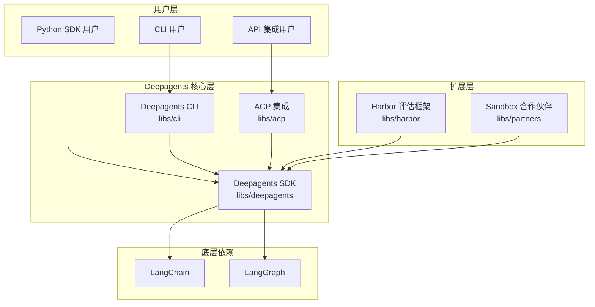
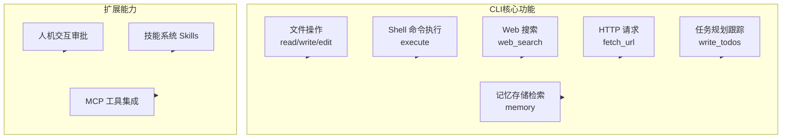
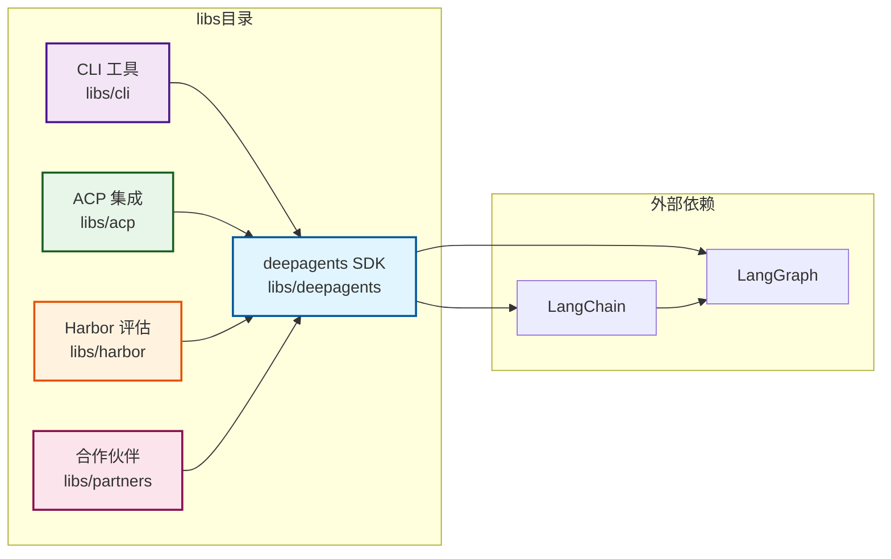
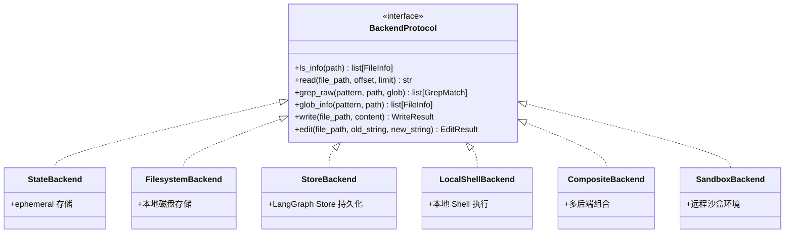
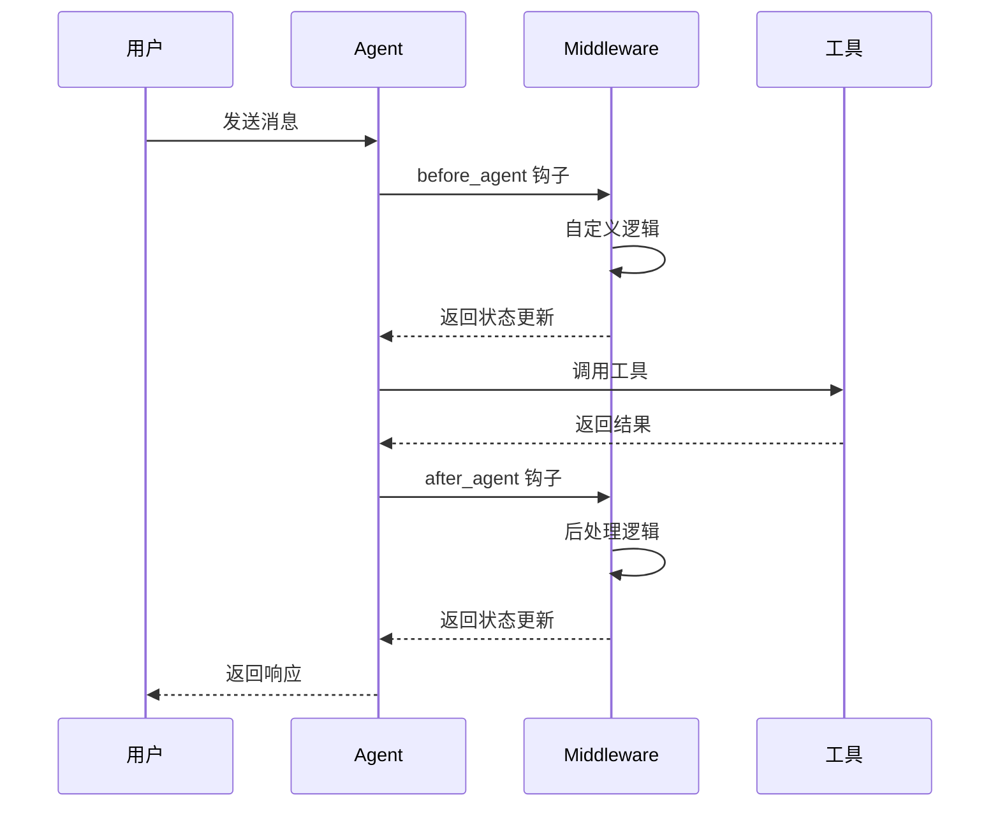
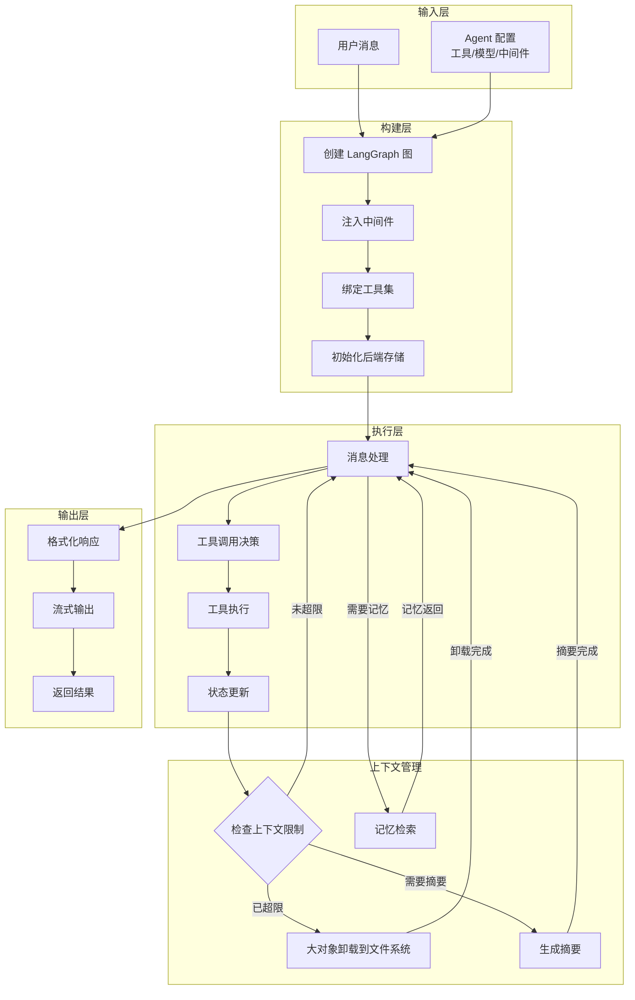

# Deepagents 项目深度调研报告

## 一、项目概述

Deepagents 是 LangChain 官方开源的 Agent（智能体）框架，被誉为「开箱即用的 Agent 马甲」（Agent Harness）。该项目旨在提供一个功能完备的 Agent 开发平台，让开发者无需自行组装提示词、工具和上下文管理，就能快速构建能够处理复杂多步骤任务的智能体。Deepagents 基于 LangChain 和 LangGraph 构建，利用 LangGraph 的运行时实现持久化执行、流式输出、人机交互和其他企业级特性。项目采用 MIT 开源协议，目前在 GitHub 上已获得超过 10,000 颗星标，充分证明了其在开发者社区中的影响力和认可度。

Deepagents 的设计理念深受 Claude Code 启发，最初的目标是探索是什么让 Claude Code 变得通用，并在此基础上进行扩展和优化。项目不仅提供了功能强大的 Python SDK，还包含一个交互式终端命令行工具（CLI），支持持久化记忆、跨会话上下文保持、项目约定学习、可定制技能以及带审批控制的代码执行功能。这种全面的解决方案使 Deepagents 成为构建生产级 Agent 应用的理想选择。

## 二、项目整体架构

Deepagents 采用模块化的单体仓库（Monorepo）架构，整个项目包含多个相互协作的库（libs），每个库负责特定的功能领域。这种架构设计既保证了代码的模块化程度，又便于统一管理和版本控制。以下是项目的整体架构示意图：



从架构图中可以清晰地看出，Deepagents SDK 是整个生态系统的核心，CLI 和 ACP 都依赖于 SDK 的功能实现。Harbor 评估框架和 Sandbox 合作伙伴集成则是在 SDK 基础上的扩展功能。这种分层架构确保了核心功能的稳定性和可扩展性，同时为不同使用场景提供了灵活的接入方式。

## 三、核心组件详细分析

Deepagents 项目由多个核心组件构成，每个组件都有其特定的职责和功能定位。以下将详细介绍各个组件的结构、功能以及它们之间的依赖关系。

### 3.1 Deepagents SDK（libs/deepagents）

Deepagents SDK 是整个项目的心脏地带，提供了构建 Deep Agent 的核心 API 和所有内置能力。该库是其他所有 Deep Agents 相关产品的底层依赖，包含 Agent 创建、工具系统、文件系统后端、中间件等核心功能的实现。

**核心功能模块：**

| 模块名称 | 功能描述 | 关键类/函数 |
|---------|---------|------------|
| Graph 模块 | Agent 创建和图构建 | `create_deep_agent()` |
| Middleware 模块 | 中间件系统 | `TodoListMiddleware`, `FilesystemMiddleware`, `SubAgentMiddleware`, `SummarizationMiddleware`, `MemoryMiddleware`, `SkillsMiddleware`, `HumanInTheLoopMiddleware` |
| Backends 模块 | 文件系统后端 | `StateBackend`, `FilesystemBackend`, `LocalShellBackend`, `StoreBackend`, `CompositeBackend`, `SandboxBackend` |
| 工具模块 | 内置工具集 | `write_todos`, `read_file`, `write_file`, `edit_file`, `ls`, `glob`, `grep`, `execute` |

SDK 的设计遵循高度可扩展的原则，开发者可以通过自定义中间件、后端存储和工具来完全定制 Agent 的行为。默认配置下，Deep Agent 会自动获得任务规划、文件管理、子 Agent 委托和上下文压缩等能力，无需额外配置即可处理复杂的、多步骤的任务。

### 3.2 Deepagents CLI（libs/cli）

Deepagents CLI 是一个基于 Deep Agents SDK 构建的交互式终端编码 Agent。它提供了一个友好的命令行界面，让用户能够直接在终端中与 Agent 进行交互式对话。该 CLI 工具使用 Textual TUI 框架构建，具有出色的用户体验和丰富的交互功能。

**核心功能特性：**



CLI 工具支持多种运行模式，包括交互式对话模式和非交互式批量执行模式。用户可以通过斜杠命令（/model、/remember、/tokens 等）来控制 Agent 的行为，也可以使用快捷键来快速完成常见操作。此外，CLI 还支持通过配置文件进行深度定制，包括默认模型、记忆存储路径、技能目录等都可以根据用户需求进行调整。

### 3.3 ACP（Agent Client Protocol）集成（libs/acp）

ACP 是 Agent Client Protocol 的缩写，是 Deepagents 项目中用于与外部系统进行 Agent 通信的组件。该组件提供了标准化的协议接口，使得不同的客户端系统能够以统一的方式与 Deep Agent 进行交互。ACP 的设计遵循现代分布式系统的最佳实践，支持异步通信、流式响应和状态持久化等高级特性。

### 3.4 Harbor 评估框架（libs/harbor）

Harbor 是 Deepagents 项目中专门用于 Agent 评估和基准测试的框架。该框架提供了一套完整的评估工具和方法论，帮助开发者量化 Agent 的性能、可靠性和质量。Harbor 支持多种评估指标，包括任务完成率、响应时间、工具使用效率等，并且提供了可视化报告功能，方便开发者分析和优化 Agent 的行为。

### 3.5 Sandbox 合作伙伴集成（libs/partners）

Sandbox 合作伙伴模块提供了与第三方沙盒环境的集成支持，使 Deep Agent 能够在隔离的远程环境中执行代码。当前支持的主要合作伙伴包括：

| 合作伙伴 | 包名称 | 功能描述 |
|---------|--------|---------|
| Daytona | langchain-daytona | 提供 Daytona 沙盒环境 |
| Modal | langchain-modal | 提供 Modal 沙盒环境 |
| Runloop | langchain-runloop | 提供 Runloop 沙盒环境 |

这些沙盒集成使 Deep Agent 能够安全地执行任意代码，而不会对本地系统造成任何风险。沙盒环境通常包含完整的开发工具链、依赖管理器和文件系统访问，非常适合运行测试、构建项目和执行其他开发任务。

## 四、组件依赖关系

Deepagents 项目的各个组件之间存在清晰的依赖关系，理解这些关系对于正确使用和扩展框架至关重要。以下是详细的依赖关系分析：



从上述依赖图可以总结出以下关键点：

**直接依赖关系：**

| 组件 | 直接依赖 | 依赖类型 |
|-----|---------|---------|
| deepagents SDK | LangChain, LangGraph | 强依赖（核心依赖） |
| CLI | deepagents SDK | 强依赖 |
| ACP | deepagents SDK | 强依赖 |
| Harbor | deepagents SDK | 强依赖 |
| Partners | deepagents SDK | 强依赖 |

**间接依赖链：**

所有组件最终都依赖于 LangChain 和 LangGraph，这两层提供了最基础的 Agent 抽象、工具系统、消息处理和图执行引擎。这种设计确保了整个生态系统的一致性和互操作性。

## 五、各组件入口文件

理解每个组件的入口文件对于快速定位代码和进行二次开发至关重要。以下是各主要组件的入口文件位置和关键导出：

### 5.1 Deepagents SDK 入口

```mermaid
graph TB
    subgraph deepagents库
        入口[__init__.py<br/>入口文件]
        graph模块[graph/<br/>Agent创建]
        middleware[middleware/<br/>中间件]
        backends[backends/<br/>后端存储]
        tools[tools/<br/>工具]
    end

    入口 --> graph模块
    入口 --> middleware
    入口 --> backends
    入口 --> tools
```

**关键入口文件和导出：**

| 文件路径 | 导出内容 | 用途 |
|---------|---------|------|
| `libs/deepagents/deepagents/__init__.py` | `create_deep_agent`, `SkillMetadata`, `SubAgent`, `CompiledSubAgent` 等 | 主入口，导出所有公共 API |
| `libs/deepagents/deepagents/graph/__init__.py` | `create_deep_agent()` | Agent 创建函数 |
| `libs/deepagents/deepagents/graph/graph.py` | Agent 图构建逻辑 | 核心图构建实现 |
| `libs/deepagents/deepagents/middleware/__init__.py` | 各种 Middleware 类 | 中间件系统入口 |
| `libs/deepagents/deepagents/backends/__init__.py` | `StateBackend`, `FilesystemBackend`, `StoreBackend` 等 | 后端系统入口 |
| `libs/deepagents/deepagents/backends/protocol.py` | `BackendProtocol` | 后端协议定义 |

**主要导出函数和使用方式：**

```python
# 核心 API 导入方式
from deepagents import create_deep_agent

# 中间件导入
from deepagents.middleware.filesystem import FilesystemMiddleware
from deepagents.middleware.subagents import SubAgentMiddleware
from deepagents.middleware.todos import TodoListMiddleware
from deepagents.middleware.summarization import SummarizationMiddleware
from deepagents.middleware.memory import MemoryMiddleware
from deepagents.middleware.skills import SkillsMiddleware
from deepagents.middleware.human_in_the_loop import HumanInTheLoopMiddleware

# 后端存储导入
from deepagents.backends import StateBackend
from deepagents.backends.filesystem import FilesystemBackend
from deepagents.backends.store import StoreBackend
from deepagents.backends.local_shell import LocalShellBackend
from deepagents.backends.composite import CompositeBackend
```

### 5.2 CLI 入口

| 文件路径 | 描述 |
|---------|------|
| `libs/cli/deepagents_cli/__main__.py` | CLI 主入口，定义命令行入口点 |
| `libs/cli/deepagents_cli/cli.py` | CLI 核心逻辑，包含 TUI 实现 |
| `libs/cli/deepagents_cli/commands/` | 命令子目录，包含各种 CLI 命令实现 |

CLI 的安装入口点通常配置为 `deepagents` 命令，安装后可直接在终端调用。

### 5.3 ACP 入口

| 文件路径 | 描述 |
|---------|------|
| `libs/acp/deepagents_acp/__init__.py` | ACP 模块入口 |
| `libs/acp/deepagents_acp/client.py` | ACP 客户端实现 |
| `libs/acp/deepagents_acp/server.py` | ACP 服务端实现 |

### 5.4 Harbor 入口

| 文件路径 | 描述 |
|---------|------|
| `libs/harbor/deepagents_harbor/__init__.py` | Harbor 评估框架入口 |
| `libs/harbor/deepagents_harbor/evaluator.py` | 评估器核心实现 |
| `libs/harbor/deepagents_harbor/benchmarks/` | 基准测试套件 |

## 六、扩展点详解

Deepagents 框架提供了丰富的扩展点，允许开发者根据特定需求定制 Agent 的行为。以下是主要的扩展点及其使用方式：

### 6.1 自定义后端存储（Backend Extension）

后端存储是 Deepagents 最强大的扩展点之一。框架提供了完整的后端协议（BackendProtocol），开发者可以实现自己的后端来支持不同的存储方式。内置的后端实现包括：



**自定义后端示例：**

```python
from deepagents.backends.protocol import BackendProtocol, WriteResult, EditResult
from deepagents.backends.utils import FileInfo, GrepMatch

class S3Backend(BackendProtocol):
    """自定义 S3 后端存储"""
    
    def __init__(self, bucket: str, prefix: str = ""):
        self.bucket = bucket
        self.prefix = prefix.rstrip("/")

    def ls_info(self, path: str) -> list[FileInfo]:
        # 实现 S3 列表操作
        ...

    def read(self, file_path: str, offset: int = 0, limit: int = 2000) -> str:
        # 实现 S3 读取操作
        ...

    def write(self, file_path: str, content: str) -> WriteResult:
        # 实现 S3 写入操作
        ...

    def edit(self, file_path: str, old_string: str, new_string: str, replace_all: bool = False) -> EditResult:
        # 实现 S3 编辑操作
        ...

# 使用自定义后端
agent = create_deep_agent(
    backend=S3Backend(bucket="my-agent-files", prefix="agents/")
)
```

### 6.2 自定义中间件（Middleware Extension）

中间件系统是另一个重要的扩展点，允许开发者在 Agent 执行流程中注入自定义逻辑。框架提供了多种内置中间件，同时也支持完全自定义的中间件实现：



**内置中间件列表：**

| 中间件名称 | 功能描述 | 扩展方式 |
|-----------|---------|---------|
| TodoListMiddleware | 任务列表规划和跟踪 | 自动启用 |
| FilesystemMiddleware | 虚拟文件系统操作 | 自动启用 |
| SubAgentMiddleware | 子 Agent 委托管理 | 自动启用 |
| SummarizationMiddleware | 上下文压缩和摘要 | 自动启用 |
| AnthropicPromptCachingMiddleware | Anthropic 模型缓存优化 | 使用 Anthropic 模型时自动启用 |
| PatchToolCallsMiddleware | 工具调用修复 | 自动启用 |
| MemoryMiddleware | 持久化记忆存储 | 配置 memory 参数时启用 |
| SkillsMiddleware | 技能系统加载 | 配置 skills 参数时启用 |
| HumanInTheLoopMiddleware | 人机交互审批 | 配置 interrupt_on 参数时启用 |

**自定义中间件示例：**

```python
from langchain.agents.middleware import AgentMiddleware
from deepagents import create_deep_agent

class CustomMiddleware(AgentMiddleware):
    """自定义中间件示例"""
    
    def __init__(self):
        pass

    def before_agent(self, state, runtime):
        # Agent 执行前的逻辑
        return {"custom_field": "value"}

    def after_agent(self, state, runtime, response):
        # Agent 执行后的逻辑
        return state

# 使用自定义中间件
agent = create_deep_agent(
    middleware=[CustomMiddleware()]
)
```

### 6.3 自定义工具（Tool Extension）

Deepagents 允许开发者向 Agent 添加自定义工具。工具可以是简单的 Python 函数，通过 `@tool` 装饰器即可自动转换为 Agent 可用的工具：

```python
from langchain.tools import tool
from deepagents import create_deep_agent

@tool
def get_weather(city: str) -> str:
    """获取指定城市的天气信息"""
    # 实现天气查询逻辑
    return f"{city} 的天气是晴天"

@tool
def calculate(expression: str) -> str:
    """执行数学计算"""
    # 实现计算逻辑
    return str(eval(expression))

# 创建带有自定义工具的 Agent
agent = create_deep_agent(
    tools=[get_weather, calculate]
)
```

### 6.4 自定义子 Agent（SubAgent Extension）

子 Agent 系统允许创建专门化的 Agent 来处理特定任务，这有助于保持主 Agent 上下文的清晰性：

```python
from deepagents import create_deep_agent

# 定义研究子 Agent
research_subagent = {
    "name": "research-agent",
    "description": "用于深入研究问题的专业 Agent",
    "system_prompt": "你是一个优秀的研究员。",
    "tools": [internet_search],
    "model": "openai:gpt-4o",  # 可选，覆盖主 Agent 模型
}

# 创建带有子 Agent 的主 Agent
agent = create_deep_agent(
    model="claude-sonnet-4-6",
    subagents=[research_subagent]
)
```

### 6.5 技能系统（Skills Extension）

技能系统允许开发者为 Agent 提供专业领域的知识和工作流程。技能遵循 Agent Skills 标准规范：

```python
from deepagents import create_deep_agent
from deepagents.backends import FilesystemBackend

# 创建带有技能的 Agent
agent = create_deep_agent(
    skills=["/skills/"],  # 技能目录路径
    backend=FilesystemBackend(root_dir="/path/to/project")
)
```

技能文件结构如下：

```
skills/
└── web-research/
    └── SKILL.md    # 技能定义文件
```

### 6.6 记忆系统（Memory Extension）

记忆系统允许 Agent 跨会话持久化存储信息：

```python
from deepagents import create_deep_agent
from deepagents.backends import StoreBackend
from langgraph.store.memory import InMemoryStore

store = InMemoryStore()

agent = create_deep_agent(
    backend=lambda rt: StoreBackend(rt),
    store=store,
    memory=["/AGENTS.md"]
)
```

### 6.7 模型提供商扩展

Deepagents 支持多种模型提供商，包括 OpenAI、Anthropic、Google Gemini、AWS Bedrock、HuggingFace 等：

```python
from langchain.chat_models import init_chat_model
from deepagents import create_deep_agent

# 使用不同的模型提供商
agent = create_deep_agent(model="openai:gpt-4o")
agent = create_deep_agent(model="anthropic:claude-sonnet-4-6")
agent = create_deep_agent(model="google_genai:gemini-2.5-flash-lite")

# 或使用自定义模型对象
model = init_chat_model(model="claude-sonnet-4-6", temperature=0.7)
agent = create_deep_agent(model=model)
```

## 七、核心执行流程

了解 Deep Agent 的核心执行流程有助于更好地理解整个系统的工作原理：



## 八、总结与建议

Deepagents 是一个设计精良、功能完备的 Agent 开发框架。其主要优势体现在以下几个方面：首先，框架基于 LangGraph 构建，继承了 LangChain 生态系统的所有优点，包括出色的可扩展性、丰富的集成选项和成熟的工程实践；其次，框架提供了开箱即用的完整功能，包括任务规划、文件管理、子 Agent 委托和上下文压缩等，无需开发者从零开始构建这些复杂的功能；第三，框架支持多种部署方式，从本地开发到云端沙盒环境，都能找到合适的解决方案；最后，框架的扩展性设计非常优秀，无论是自定义后端、中间件还是工具，都能以统一的方式进行集成。

对于希望快速构建 Agent 应用的开发者，建议从 Deepagents SDK 入手，利用其内置的默认配置即可获得一个功能完备的 Agent。对于需要更精细控制的场景，可以通过配置不同的后端存储、添加自定义中间件和技能来满足特定需求。对于需要与现有系统集成的场景，ACP 提供了一套标准化的协议接口，可以方便地实现与其他系统的对接。

## 九、参考资源

- 官方文档：https://docs.langchain.com/oss/python/deepagents/overview
- GitHub 仓库：https://github.com/langchain-ai/deepagents
- API 参考：https://reference.langchain.com/python/deepagents/
- CLI 文档：https://docs.langchain.com/oss/python/deepagents/cli/overview
- 后端文档：https://docs.langchain.com/oss/python/deepagents/backends
- 子 Agent 文档：https://docs.langchain.com/oss/python/deepagents/subagents

---

*本报告基于 Deepagents 项目截至 2026 年 3 月的源码和文档编制。*
