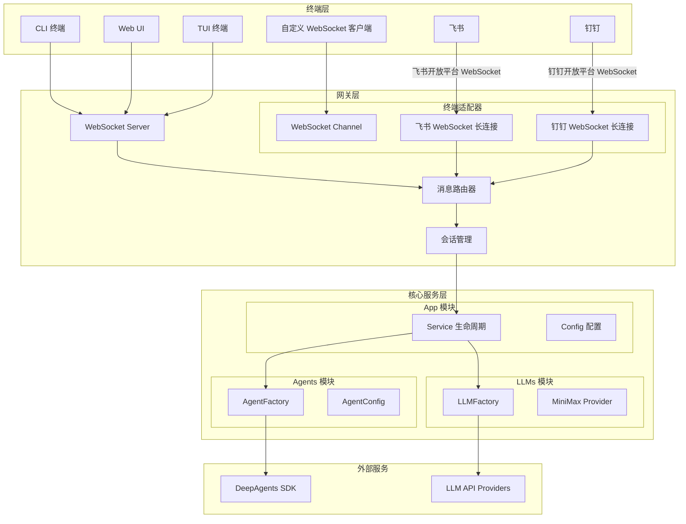
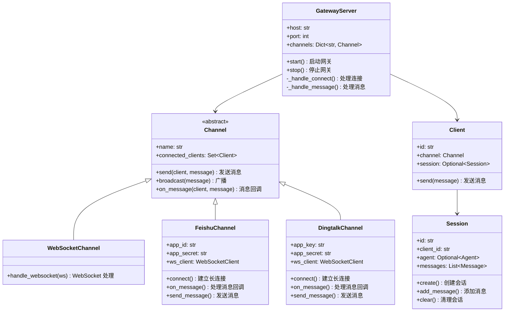
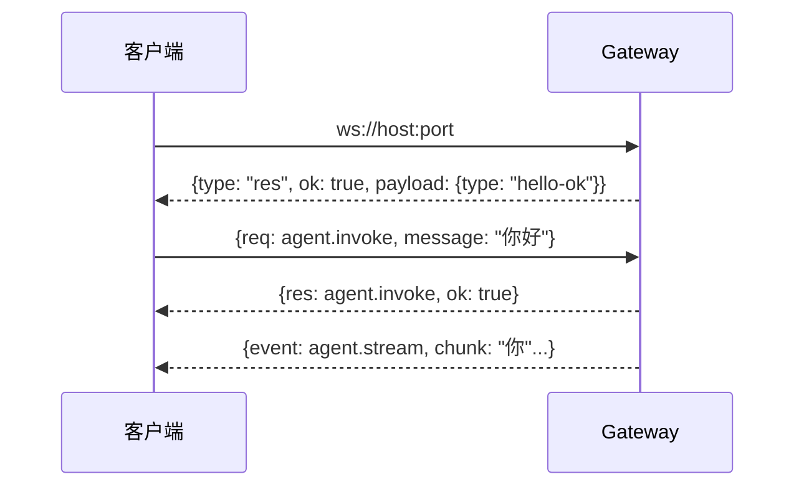
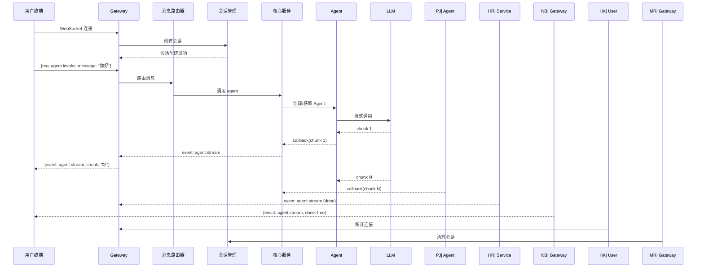

# MinerBot Gateway 架构改造方案

## 1. 背景与目标

### 1.1 当前架构问题

当前 MinerBot 采用**紧耦合**架构：

```
用户 → REPL(CLI) → Service → Agent → LLM
```

- 只能通过本地 CLI/REPL 交互
- 缺少对多终端（Web UI、TUI、飞书、钉钉等）的支持
- 无法远程访问

### 1.2 改造目标

参考 **OpenClaw Gateway** 设计，新增 **Gateway 层**实现：

1. **多终端接入**: 支持 Web UI、TUI、CLI、飞书、钉钉、WebSocket 客户端
2. **协议解耦**: 终端协议与核心服务分离
3. **WebSocket 通讯**: 长连接，支持流式响应
4. **统一控制平面**: 所有客户端通过 Gateway 访问核心服务

---

## 2. 新架构设计

### 2.1 整体架构图



### 2.2 分层职责

| 层级 | 职责 | 模块 |
|------|------|------|
| **终端层** | 用户交互界面 | CLI, Web UI, TUI, 飞书, 钉钉 |
| **网关层** | 协议接入、路由、会话 | `src/gateway/*` |
| **核心服务层** | 业务逻辑、Agent、LLM | `src/app`, `src/agents`, `src/llms` |

---

## 3. Gateway 模块设计

### 3.1 模块结构

```
src/gateway/
├── __init__.py
├── server.py           # WebSocket 服务器
├── protocol.py         # 协议定义
├── session.py          # 会话管理
├── router.py           # 消息路由
├── client.py           # 客户端连接
│
├── channels/           # 终端适配器
│   ├── __init__.py
│   ├── base.py        # Channel 基类
│   ├── ws.py          # WebSocket 通道
│   ├── feishu.py      # 飞书 - WebSocket
│   └── dingtalk.py    # 钉钉 - WebSocket
│
├── protocols/          # 协议编解码
│   ├── __init__.py
│   └── json.py        # JSON 协议
│
└── handlers/          # 消息处理器
    ├── __init__.py
    ├── message.py     # 消息处理
    ├── agent.py       # Agent 调用处理
    └── control.py     # 控制指令处理
```

### 3.2 核心类设计



---

## 4. 协议设计

### 4.1 帧格式

采用 JSON over WebSocket：

```json
// 请求帧 (req)
{
  "type": "req",
  "id": "req-001",
  "method": "agent.invoke",
  "params": {
    "message": "你好",
    "stream": true
  }
}

// 响应帧 (res)
{
  "type": "res",
  "id": "req-001",
  "ok": true,
  "payload": {
    "response": "你好！有什么可以帮你的？"
  }
}

// 错误响应
{
  "type": "res",
  "id": "req-001",
  "ok": false,
  "error": {
    "code": "ERROR_CODE",
    "message": "错误信息"
  }
}

// 事件帧 (event)
{
  "type": "event",
  "event": "agent.stream",
  "payload": {
    "chunk": "你好",
    "done": false
  }
}
```

### 4.2 连接握手



### 4.3 方法定义

| 方法 | 说明 |
|------|------|
| `connect` | 连接握手 |
| `agent.invoke` | 调用 Agent |
| `agent.stream` | 流式调用 Agent |
| `session.create` | 创建会话 |
| `session.clear` | 清理会话 |
| `health` | 健康检查 |

---

## 5. 终端适配器

### 5.1 终端通讯方式

| 终端 | 通讯协议 | 说明 |
|------|----------|------|
| **CLI/Web UI/TUI** | WebSocket | 直接连接 Gateway WebSocket 服务器 |
| **飞书** | WebSocket 长连接 | 通过飞书开放平台 Event Subscriptions (WebSocket 模式) |
| **钉钉** | WebSocket 长连接 | 通过钉钉开放平台 Stream 模式 |
| **微信** | WebHook (预留) | 需要企业微信资质 |

### 5.2 飞书适配器 (WebSocket 长连接)

```mermaid
flowchart LR
    subgraph 飞书开放平台
        FEISHU_API[飞书 API]
        FEISHU_WS[Event WebSocket<br/>长连接]
    end

    subgraph MinerBot Gateway
        FEISHU_ADAPTER[飞书适配器]
        ROUTER[消息路由器]
    end

    subgraph 核心服务
        AGENT[Agent]
        LLM[LLM]
    end

    FEISHU_USER[飞书用户] -->|@机器人| FEISHU_API
    FEISHU_API -->|消息事件| FEISHU_WS
    FEISHU_WS -->|WebSocket| FEISHU_ADAPTER
    FEISHU_ADAPTER --> ROUTER
    ROUTER --> AGENT
    AGENT --> LLM
    LLM --> AGENT
    AGENT --> FEISHU_ADAPTER
    FEISHU_ADAPTER -->|回复消息| FEISHU_API
    FEISHU_API -->|推送回复| FEISHU_USER
```

**飞书配置要点**:
- 使用飞书开放平台的 **Event Subscriptions** 功能
- 选择 **WebSocket** 订阅模式（非 HTTP Webhook）
- 需要服务器能访问 `open.feishu.cn`

### 5.3 钉钉适配器 (WebSocket 长连接)

```mermaid
flowchart LR
    subgraph 钉钉开放平台
        DINGTALK_API[钉钉 API]
        DINGTALK_WS[Stream WebSocket<br/>长连接]
    end

    subgraph MinerBot Gateway
        DINGTALK_ADAPTER[钉钉适配器]
        ROUTER[消息路由器]
    end

    subgraph 核心服务
        AGENT[Agent]
        LLM[LLM]
    end

    DINGTALK_USER[钉钉用户] -->|@机器人| DINGTALK_API
    DINGTALK_API -->|消息事件| DINGTALK_WS
    DINGTALK_WS -->|WebSocket| DINGTALK_ADAPTER
    DINGTALK_ADAPTER --> ROUTER
    ROUTER --> AGENT
    AGENT --> LLM
    LLM --> AGENT
    RY|    AGENT --> DINGTALK_ADAPTER
    DINGTALK_ADAPTER -->|回复消息| DINGTALK_API
    DINGTALK_API -->|推送回复| DINGTALK_USER
```

**钉钉配置要点**:
- 使用钉钉企业机器人的 **Stream 模式**（非回调模式）
- 需要启用机器人能力并配置 Stream 模式

---

## 6. 消息流设计

### 6.1 完整消息流程



---

## 7. 文件结构

```
minerbot/
├── src/
│   ├── main.py                    # 入口 (保留 CLI 模式)
│   │
│   ├── app/                       # 应用层 (核心服务)
│   │   ├── __init__.py
│   │   ├── config.py
│   │   ├── service.py             # Service 保持不变
│   │   └── repl.py               # REPL 保持不变
│   │
│   ├── gateway/                   # ★ 新增: 网关层
│   │   ├── __init__.py
│   │   ├── server.py              # WebSocket 服务器
│   │   ├── protocol.py            # 协议定义
│   │   ├── session.py             # 会话管理
│   │   ├── router.py              # 消息路由
│   │   ├── client.py              # 客户端连接
│   │   │
│   │   ├── channels/              # 终端适配器
│   │   │   ├── __init__.py
│   │   │   ├── base.py           # Channel 基类
│   │   │   ├── ws.py             # WebSocket 通道
│   │   │   ├── feishu.py         # 飞书适配器 (WebSocket)
│   │   │   └── dingtalk.py        # 钉钉适配器 (WebSocket)
│   │   │
│   │   ├── protocols/             # 协议编解码
│   │   │   ├── __init__.py
│   │   │   └── json.py            # JSON 协议
│   │   │
│   │   └── handlers/              # 消息处理器
│   │       ├── __init__.py
│   │       ├── message.py         # 消息处理
│   │       ├── agent.py           # Agent 调用处理
│   │       └── control.py         # 控制指令处理
│   │
│   ├── agents/                    # Agent 层
│   ├── llms/                     # LLM 层
│   └── ...
│
├── config/
│   ├── app_config.yaml            # 应用配置
│   ├── llm_config.yaml            # LLM 配置
│   ├── agent_config.yaml          # Agent 配置
│   └── gateway_config.yaml        # ★ 新增: Gateway 配置
│
└── ...
```

---

## 8. Gateway 配置

### 8.1 gateway_config.yaml

```yaml
# Gateway 配置
gateway:
  # WebSocket 服务器配置
  server:
    host: "0.0.0.0"
    port: 18789
    
  # 允许的终端类型
  allowed_channels:
    - ws          # WebSocket
    - feishu      # 飞书 (WebSocket)
    - dingtalk    # 钉钉 (WebSocket)

# 飞书配置 (WebSocket 长连接模式)
feishu:
  app_id: ${FEISHU_APP_ID}
  app_secret: ${FEISHU_APP_SECRET}

# 钉钉配置 (Stream 模式)
dingtalk:
  app_key: ${DINGTALK_APP_KEY}
  app_secret: ${DINGTALK_APP_SECRET}
```

---

## 9. 运行模式

### 9.1 原有模式 (CLI)

```bash
python -m src.main --config config/app_config.yaml
```

### 9.2 Gateway 模式

```bash
# 启动 Gateway (WebSocket)
python -m src.gateway --config config/gateway_config.yaml

# 启动 Gateway + 内置核心服务
python -m src.gateway --config config/gateway_config.yaml --with-service
```

---

## 10. 实施计划

| 阶段 | 目标 | 交付物 |
|------|------|--------|
| **Phase 1** | 基础 Gateway | `src/gateway/*`, WebSocket 服务 |
| **Phase 2** | 核心协议 | `protocol.py`, `handlers/*` |
| **Phase 3** | 会话管理 | `session.py`, 消息路由 |
| **Phase 4** | 飞书适配器 | `channels/feishu.py` - WebSocket |
| **Phase 5** | 钉钉适配器 | `channels/dingtalk.py` - WebSocket |

### 10.1 依赖更新

```toml
# pyproject.toml 新增依赖
dependencies = [
    ...
    "websockets>=12.0",        # WebSocket 服务器/客户端
    "aiohttp>=3.9.0",          # HTTP 客户端/服务器
]
```

---

## 11. 向后兼容性

- `src/main.py` 保持不变
- REPL 模式仍然可用
- 现有 CLI 用户无感知

---

## 12. 总结

### 12.1 架构优势

1. **解耦**: 终端协议与核心服务分离
2. **扩展性**: 新增终端只需实现 Channel
3. **简洁**: 无需认证鉴权模块
4. **长连接**: 飞书/钉钉使用 WebSocket 长连接

### 12.2 关键设计要点

- **所有终端都通过 WebSocket 连接到 Gateway**
- **飞书使用 Event Subscriptions 的 WebSocket 模式**
- **钉钉使用 Stream 模式（WebSocket 长连接）**
- **无需公网服务器即可接收消息**

---

# 13. 核心类详细设计

## 13.1 GatewayServer (server.py)

```python
"""Gateway 服务器 - WebSocket 服务入口"""

import asyncio
import signal
import sys
from typing import Any, Optional

import websockets
from websockets.server import WebSocketServerProtocol

from src.gateway.session import SessionManager
from src.gateway.router import MessageRouter
from src.gateway.channels import ChannelRegistry


class GatewayServer:
    """Gateway WebSocket 服务器
    
    管理 WebSocket 连接、Channel 注册、消息路由。
    遵循 Service 层的生命周期模式（start/stop）。
    """
    
    def __init__(self, config: GatewayConfig) -> None:
        self._config = config
        self._host = config.server.host
        self._port = config.server.port
        self._running = False
        self._server: Optional[websockets.WebSocketServer] = None
        self._shutdown_event = asyncio.Event()
        self._signal_received: Optional[signal.Signals] = None
        
        # 核心组件
        self._session_manager = SessionManager()
        self._router = MessageRouter(self._session_manager)
        self._channel_registry = ChannelRegistry()
        
        # 任务管理
        self._tasks: set[asyncio.Task] = set()
        
        self._setup_signal_handlers()
    
    @property
    def is_running(self) -> bool:
        return self._running
    
    @property
    def session_manager(self) -> SessionManager:
        return self._session_manager
    
    async def start(self) -> None:
        """启动 Gateway 服务器"""
        if self._running:
            raise RuntimeError("Gateway 已经在运行")
        
        print(f"正在启动 Gateway ({self._host}:{self._port})...")
        
        try:
            # 启动 WebSocket 服务器
            self._server = await websockets.serve(
                self._handle_connection,
                self._host,
                self._port,
                ping_interval=self._config.server.ping_interval,
                ping_timeout=self._config.server.ping_timeout,
                max_size=self._config.server.max_message_size,
            )
            
            # 初始化 Channel 适配器
            await self._channel_registry.start_all()
            
            self._running = True
            self._shutdown_event.clear()
            print(f"Gateway 启动成功 (ws://{self._host}:{self._port})")
            
        except Exception as e:
            print(f"Gateway 启动失败: {e}")
            await self._cleanup()
            raise
    
    async def _handle_connection(
        self, 
        ws: WebSocketServerProtocol, 
        path: str
    ) -> None:
        """处理 WebSocket 连接
        
        Args:
            ws: WebSocket 连接
            path: 连接路径（用于区分 Channel 类型）
        """
        client_id = self._generate_client_id()
        print(f"新连接: {client_id} (path: {path})")
        
        # 根据 path 选择 Channel
        channel = self._channel_registry.get_channel(path)
        
        try:
            # 创建 Client 并处理消息
            client = await channel.handle_connect(ws, client_id)
            
            # 关联到会话
            session = self._session_manager.create_session(client_id)
            client.session = session
            
            # 启动消息处理循环
            await channel.handle_messages(client)
            
        except websockets.exceptions.ConnectionClosed as e:
            print(f"连接关闭: {client_id} (code: {e.code}, reason: {e.reason})")
        except Exception as e:
            print(f"连接错误: {client_id} - {e}")
        finally:
            # 清理会话
            self._session_manager.clear_session(client_id)
            await channel.handle_disconnect(client_id)
            print(f"连接已关闭: {client_id}")
    
    async def stop(self) -> None:
        """停止 Gateway 服务器"""
        if not self._running:
            return
        
        print("正在停止 Gateway...")
        
        try:
            # 停止接受新连接
            if self._server:
                self._server.close()
                await self._server.wait_closed()
            
            # 停止所有 Channel
            await self._channel_registry.stop_all()
            
            # 取消所有运行中的任务
            for task in self._tasks:
                task.cancel()
            
            await self._cleanup()
            
        finally:
            self._running = False
            self._shutdown_event.set()
            print("Gateway 已停止")
    
    async def _cleanup(self) -> None:
        """清理资源"""
        await self._channel_registry.stop_all()
        self._session_manager.clear_all()
    
    def _setup_signal_handlers(self) -> None:
        """设置信号处理器"""
        if sys.platform != "win32":
            loop = asyncio.get_event_loop()
            for sig in (signal.SIGINT, signal.SIGTERM):
                try:
                    loop.add_signal_handler(
                        sig,
                        lambda s=sig: asyncio.create_task(self._handle_signal(s))
                    )
                except NotImplementedError:
                    pass
    
    async def _handle_signal(self, sig: signal.Signals) -> None:
        """处理信号"""
        self._signal_received = sig
        print(f"\n收到信号 {sig.name}，正在关闭 Gateway...")
        await self.stop()
    
    async def wait_for_shutdown(self) -> None:
        """等待关闭事件"""
        await self._shutdown_event.wait()
    
    @staticmethod
    def _generate_client_id() -> str:
        """生成客户端 ID"""
        import uuid
        return f"client-{uuid.uuid4().hex[:8]}"
```

## 13.2 Protocol (protocol.py)

```python
"""协议定义 - 消息帧编解码"""

import json
from dataclasses import dataclass, field
from typing import Any, Optional
from enum import Enum
import uuid


class MessageType(str, Enum):
    """消息类型"""
    REQ = "req"      # 请求
    RES = "res"      # 响应
    EVENT = "event"  # 事件


class ErrorCode(str, Enum):
    """错误码定义"""
    # 通用错误 (1xxx)
    INVALID_REQUEST = "INVALID_REQUEST"      # 无效请求
    METHOD_NOT_FOUND = "METHOD_NOT_FOUND"    # 方法不存在
    INTERNAL_ERROR = "INTERNAL_ERROR"        # 内部错误
    
    # 会话错误 (2xxx)
    SESSION_NOT_FOUND = "SESSION_NOT_FOUND"   # 会话不存在
    SESSION_EXPIRED = "SESSION_EXPIRED"       # 会话过期
    
    # Agent 错误 (3xxx)
    AGENT_ERROR = "AGENT_ERROR"              # Agent 执行错误
    AGENT_TIMEOUT = "AGENT_TIMEOUT"          # Agent 超时
    SERVICE_NOT_RUNNING = "SERVICE_NOT_RUNNING"  # 服务未运行


@dataclass
class MessageFrame:
    """消息帧
    
    Attributes:
        type: 消息类型 (req/res/event)
        id: 请求/响应关联 ID
        method: 方法名 (req 时使用)
        params: 请求参数 (req 时使用)
        ok: 是否成功 (res 时使用)
        payload: 响应数据 (res 时使用)
        event: 事件名 (event 时使用)
        error: 错误信息 (res 时使用)
    """
    type: MessageType
    id: str = field(default_factory=lambda: f"req-{uuid.uuid4().hex[:8]}")
    method: Optional[str] = None
    params: Optional[dict[str, Any]] = None
    ok: Optional[bool] = None
    payload: Optional[dict[str, Any]] = None
    event: Optional[str] = None
    error: Optional[dict[str, Any]] = None
    
    @classmethod
    def from_json(cls, data: str | bytes) -> "MessageFrame":
        """从 JSON 解析消息帧"""
        obj = json.loads(data)
        return cls(
            type=MessageType(obj.get("type", "req")),
            id=obj.get("id", f"req-{uuid.uuid4().hex[:8]}"),
            method=obj.get("method"),
            params=obj.get("params"),
            ok=obj.get("ok"),
            payload=obj.get("payload"),
            event=obj.get("event"),
            error=obj.get("error"),
        )
    
    def to_json(self) -> str:
        """序列化为 JSON"""
        obj = {"type": self.type.value, "id": self.id}
        
        if self.method:
            obj["method"] = self.method
        if self.params:
            obj["params"] = self.params
        if self.ok is not None:
            obj["ok"] = self.ok
        if self.payload:
            obj["payload"] = self.payload
        if self.event:
            obj["event"] = self.event
        if self.error:
            obj["error"] = self.error
            
        return json.dumps(obj, ensure_ascii=False)
    
    @classmethod
    def create_response(
        cls, 
        request_id: str, 
        ok: bool = True, 
        payload: Optional[dict] = None,
        error: Optional[dict] = None
    ) -> "MessageFrame":
        """创建响应帧"""
        return cls(
            type=MessageType.RES,
            id=request_id,
            ok=ok,
            payload=payload,
            error=error,
        )
    
    @classmethod
    def create_event(
        cls,
        event: str,
        payload: Optional[dict] = None
    ) -> "MessageFrame":
        """创建事件帧"""
        return cls(
            type=MessageType.EVENT,
            event=event,
            payload=payload,
        )
    
    @classmethod
    def create_error(
        cls,
        request_id: str,
        code: ErrorCode,
        message: str
    ) -> "MessageFrame":
        """创建错误响应帧"""
        return cls.create_response(
            request_id=request_id,
            ok=False,
            error={"code": code.value, "message": message}
        )
```

## 13.3 Session (session.py)

```python
"""会话管理 - 客户端会话状态"""

import asyncio
from dataclasses import dataclass, field
from datetime import datetime, timedelta
from typing import Any, Optional
from collections import deque


@dataclass
class Message:
    """会话消息"""
    role: str          # "user" | "assistant" | "system"
    content: str
    timestamp: datetime = field(default_factory=datetime.now)


@dataclass
class Session:
    """客户端会话
    
    Attributes:
        id: 会话 ID
        client_id: 客户端 ID
        agent: 绑定的 Agent 实例
        messages: 消息历史
        created_at: 创建时间
        last_active: 最后活跃时间
        metadata: 扩展元数据
    """
    id: str
    client_id: str
    agent: Optional[Any] = None
    messages: list[Message] = field(default_factory=list)
    created_at: datetime = field(default_factory=datetime.now)
    last_active: datetime = field(default_factory=datetime.now)
    metadata: dict[str, Any] = field(default_factory=dict)
    
    # 配置
    max_history: int = 100           # 最大历史消息数
    ttl: timedelta = timedelta(hours=24)  # 会话 TTL
    
    def add_message(self, role: str, content: str) -> None:
        """添加消息到历史"""
        self.messages.append(Message(role=role, content=content))
        self.last_active = datetime.now()
        
        # 修剪超长历史
        if len(self.messages) > self.max_history:
            self.messages = self.messages[-self.max_history:]
    
    def is_expired(self) -> bool:
        """检查会话是否过期"""
        return datetime.now() - self.last_active > self.ttl
    
    def clear(self) -> None:
        """清空会话"""
        self.messages.clear()
        self.agent = None
    
    def to_langchain_messages(self) -> list[dict]:
        """转换为 LangChain 消息格式"""
        from langchain_core.messages import HumanMessage, AIMessage, SystemMessage
        
        result = []
        for msg in self.messages:
            if msg.role == "user":
                result.append(HumanMessage(content=msg.content))
            elif msg.role == "assistant":
                result.append(AIMessage(content=msg.content))
            elif msg.role == "system":
                result.append(SystemMessage(content=msg.content))
        return result


class SessionManager:
    """会话管理器
    
    管理所有客户端会话，支持创建、获取、清理。
    """
    
    def __init__(self) -> None:
        self._sessions: dict[str, Session] = {}
        self._lock = asyncio.Lock()
        self._cleanup_task: Optional[asyncio.Task] = None
    
    async def start(self) -> None:
        """启动会话管理器"""
        # 启动定期清理任务
        self._cleanup_task = asyncio.create_task(self._cleanup_loop())
    
    async def stop(self) -> None:
        """停止会话管理器"""
        if self._cleanup_task:
            self._cleanup_task.cancel()
            try:
                await self._cleanup_task
            except asyncio.CancelledError:
                pass
    
    async def create_session(self, client_id: str) -> Session:
        """创建新会话"""
        import uuid
        session_id = f"sess-{uuid.uuid4().hex[:8]}"
        
        async with self._lock:
            session = Session(id=session_id, client_id=client_id)
            self._sessions[client_id] = session
            
        print(f"创建会话: {session_id} for {client_id}")
        return session
    
    async def get_session(self, client_id: str) -> Optional[Session]:
        """获取会话"""
        return self._sessions.get(client_id)
    
    async def clear_session(self, client_id: str) -> None:
        """清理会话"""
        async with self._lock:
            if client_id in self._sessions:
                session = self._sessions.pop(client_id)
                session.clear()
                print(f"清理会话: {session.id}")
    
    async def clear_all(self) -> None:
        """清理所有会话"""
        async with self._lock:
            for session in self._sessions.values():
                session.clear()
            self._sessions.clear()
            print("已清理所有会话")
    
    async def _cleanup_loop(self) -> None:
        """定期清理过期会话"""
        while True:
            try:
                await asyncio.sleep(60)  # 每分钟检查
                await self._cleanup_expired()
            except asyncio.CancelledError:
                break
            except Exception as e:
                print(f"清理会话出错: {e}")
    
    async def _cleanup_expired(self) -> None:
        """清理过期会话"""
        expired = []
        
        async with self._lock:
            for client_id, session in self._sessions.items():
                if session.is_expired():
                    expired.append(client_id)
            
            for client_id in expired:
                session = self._sessions.pop(client_id)
                session.clear()
        
        if expired:
            print(f"清理 {len(expired)} 个过期会话")
```

## 13.4 Client (client.py)

```python
"""客户端连接 - 代表一个终端连接"""

import asyncio
from dataclasses import dataclass, field
from typing import Any, Optional, Callable, Awaitable

from src.gateway.protocol import MessageFrame, MessageType
from src.gateway.session import Session


@dataclass
class Client:
    """客户端连接
    
    Attributes:
        id: 客户端唯一 ID
        channel: 所属 Channel
        session: 关联的会话
        send_queue: 发送队列（用于流式响应）
        metadata: 扩展元数据
    """
    id: str
    channel: "Channel"  # 前向引用
    session: Optional[Session] = None
    send_queue: asyncio.Queue[str] = field(default_factory=asyncio.Queue)
    metadata: dict[str, Any] = field(default_factory=dict)
    
    # 连接状态
    connected: bool = True
    
    async def send(self, frame: MessageFrame) -> None:
        """发送消息帧"""
        if not self.connected:
            return
        await self.send_queue.put(frame.to_json())
    
    async def send_response(
        self, 
        request_id: str, 
        ok: bool = True, 
        payload: Optional[dict] = None
    ) -> None:
        """发送响应"""
        frame = MessageFrame.create_response(request_id, ok, payload)
        await self.send(frame)
    
    async def send_error(
        self,
        request_id: str,
        code: str,
        message: str
    ) -> None:
        """发送错误响应"""
        frame = MessageFrame.create_error(request_id, code, message)
        await self.send(frame)
    
    async def send_event(
        self,
        event: str,
        payload: Optional[dict] = None
    ) -> None:
        """发送事件"""
        frame = MessageFrame.create_event(event, payload)
        await self.send(frame)
    
    async def close(self) -> None:
        """关闭连接"""
        self.connected = False
        # 清空队列
        while not self.send_queue.empty():
            try:
                self.send_queue.get_nowait()
            except asyncio.QueueEmpty:
                break
```

## 13.5 MessageRouter (router.py)

```python
"""消息路由器 - 请求分发给 Handler"""

from typing import Any, Callable, Optional
import asyncio

from src.gateway.protocol import MessageFrame, MessageType, ErrorCode
from src.gateway.client import Client
from src.gateway.session import Session


# Handler 类型
Handler = Callable[[Client, MessageFrame], Awaitable[None]]


class MessageRouter:
    """消息路由器
    
    根据消息类型/方法将请求分发给对应的 Handler。
    支持流式响应的回调机制。
    """
    
    def __init__(self, session_manager: "SessionManager") -> None:
        self._session_manager = session_manager
        self._handlers: dict[str, Handler] = {}
        self._stream_callbacks: dict[str, Callable[[str], Awaitable[None]]] = {}
        
        # 注册默认 Handler
        self._register_default_handlers()
    
    def _register_default_handlers(self) -> None:
        """注册默认 Handler"""
        from src.gateway.handlers.agent import AgentInvokeHandler
        from src.gateway.handlers.control import ControlHandler
        
        # Agent 相关
        self.register_handler("agent.invoke", AgentInvokeHandler.handle)
        self.register_handler("agent.stream", AgentInvokeHandler.handle_stream)
        
        # 控制指令
        self.register_handler("session.create", ControlHandler.handle_create_session)
        self.register_handler("session.clear", ControlHandler.handle_clear_session)
        self.register_handler("health", ControlHandler.handle_health)
    
    def register_handler(self, method: str, handler: Handler) -> None:
        """注册 Handler
        
        Args:
            method: 方法名
            handler: 处理函数
        """
        self._handlers[method] = handler
    
    async def route(self, client: Client, frame: MessageFrame) -> None:
        """路由消息
        
        Args:
            client: 客户端
            frame: 消息帧
        """
        # 处理响应（无路由）
        if frame.type == MessageType.RES:
            return
        
        # 处理事件（目前不处理主动推送的事件）
        if frame.type == MessageType.EVENT:
            return
        
        # 处理请求
        if frame.type == MessageType.REQ:
            await self._handle_request(client, frame)
    
    async def _handle_request(self, client: Client, frame: MessageFrame) -> None:
        """处理请求"""
        method = frame.method
        
        if not method:
            await client.send_error(
                frame.id,
                ErrorCode.INVALID_REQUEST.value,
                "缺少 method 字段"
            )
            return
        
        # 查找 Handler
        handler = self._handlers.get(method)
        
        if not handler:
            await client.send_error(
                frame.id,
                ErrorCode.METHOD_NOT_FOUND.value,
                f"方法不存在: {method}"
            )
            return
        
        try:
            # 调用 Handler
            await handler(client, frame)
            
        except Exception as e:
            print(f"Handler 执行错误: {method} - {e}")
            await client.send_error(
                frame.id,
                ErrorCode.INTERNAL_ERROR.value,
                str(e)
            )
```

---

# 14. Channel 适配器详细设计

## 14.1 Channel 基类 (channels/base.py)

```python
"""Channel 基类 - 终端适配器抽象"""

import asyncio
from abc import ABC, abstractmethod
from typing import Any, Optional

from src.gateway.client import Client


class Channel(ABC):
    """Channel 抽象基类
    
    定义终端适配器的接口。不同终端（WebSocket、飞书、钉钉）
    实现此接口以统一消息收发。
    """
    
    def __init__(self, name: str) -> None:
        """初始化 Channel
        
        Args:
            name: Channel 名称
        """
        self.name = name
        self._running = False
        self._clients: dict[str, Client] = {}
    
    @property
    def is_running(self) -> bool:
        return self._running
    
    @abstractmethod
    async def start(self) -> None:
        """启动 Channel
        
        对于需要外部连接的 Channel（如飞书、钉钉），
        在此建立连接。
        """
        pass
    
    @abstractmethod
    async def stop(self) -> None:
        """停止 Channel
        
        关闭所有连接，清理资源。
        """
        pass
    
    @abstractmethod
    async def handle_connect(
        self, 
        connection: Any, 
        client_id: str
    ) -> Client:
        """处理新连接
        
        Args:
            connection: 底层连接对象
            client_id: 客户端 ID
            
        Returns:
            创建的 Client 实例
        """
        pass
    
    @abstractmethod
    async def handle_messages(self, client: Client) -> None:
        """处理消息循环
        
        从底层连接读取消息，转换为 MessageFrame 并路由。
        持续运行直到连接关闭。
        
        Args:
            client: 客户端实例
        """
        pass
    
    @abstractmethod
    async def handle_disconnect(self, client_id: str) -> None:
        """处理连接断开
        
        Args:
            client_id: 客户端 ID
        """
        pass
    
    async def send_to_client(
        self, 
        client_id: str, 
        frame: "MessageFrame"
    ) -> bool:
        """发送消息到客户端
        
        Args:
            client_id: 客户端 ID
            frame: 消息帧
            
        Returns:
            是否发送成功
        """
        client = self._clients.get(client_id)
        if not client or not client.connected:
            return False
        
        await client.send(frame)
        return True
    
    async def broadcast(self, frame: "MessageFrame") -> int:
        """广播消息到所有客户端
        
        Returns:
            成功发送的数量
        """
        count = 0
        for client in self._clients.values():
            if client.connected:
                try:
                    await client.send(frame)
                    count += 1
                except Exception as e:
                    print(f"广播失败: {e}")
        return count
    
    def register_client(self, client: Client) -> None:
        """注册客户端"""
        self._clients[client.id] = client
    
    def unregister_client(self, client_id: str) -> None:
        """注销客户端"""
        self._clients.pop(client_id, None)
```

## 14.2 WebSocket Channel (channels/ws.py)

```python
"""WebSocket Channel - 标准 WebSocket 通道"""

import asyncio
from typing import Any, Optional

import websockets
from websockets.server import WebSocketServerProtocol

from src.gateway.client import Client
from src.gateway.protocol import MessageFrame, ErrorCode
from src.gateway.channels.base import Channel


class WebSocketChannel(Channel):
    """WebSocket 通道
    
    处理标准 WebSocket 连接（CLI、Web UI、TUI 等）。
    """
    
    def __init__(self) -> None:
        super().__init__("ws")
        self._router: Optional["MessageRouter"] = None
    
    def set_router(self, router: "MessageRouter") -> None:
        """设置消息路由器"""
        self._router = router
    
    async def start(self) -> None:
        """启动 Channel"""
        self._running = True
        print("WebSocket Channel 已启动")
    
    async def stop(self) -> None:
        """停止 Channel"""
        self._running = False
        
        # 关闭所有客户端连接
        for client in list(self._clients.values()):
            try:
                await client.close()
            except Exception as e:
                print(f"关闭客户端出错: {e}")
        
        self._clients.clear()
        print("WebSocket Channel 已停止")
    
    async def handle_connect(
        self,
        ws: WebSocketServerProtocol,
        client_id: str
    ) -> Client:
        """处理新连接"""
        # 创建 Client
        client = Client(id=client_id, channel=self)
        
        # 启动发送循环
        asyncio.create_task(self._send_loop(client, ws))
        
        # 注册客户端
        self.register_client(client)
        
        # 发送连接确认
        await client.send_response(client_id, ok=True, payload={"type": "hello-ok"})
        
        return client
    
    async def handle_messages(self, client: Client) -> None:
        """处理消息循环"""
        ws = client.metadata.get("ws")
        if not ws:
            return
        
        try:
            async for message in ws:
                if not client.connected:
                    break
                
                try:
                    # 解析消息帧
                    frame = MessageFrame.from_json(message)
                    
                    # 添加用户消息到会话
                    if client.session and frame.method == "agent.invoke":
                        msg_content = frame.params.get("message", "") if frame.params else ""
                        client.session.add_message("user", msg_content)
                    
                    # 路由消息
                    if self._router:
                        await self._router.route(client, frame)
                    
                except Exception as e:
                    print(f"消息解析错误: {e}")
                    await client.send_error(
                        frame.id if 'frame' in locals() else "unknown",
                        ErrorCode.INVALID_REQUEST.value,
                        f"消息格式错误: {e}"
                    )
                    
        except websockets.exceptions.ConnectionClosed:
            pass
        except Exception as e:
            print(f"消息循环错误: {e}")
    
    async def handle_disconnect(self, client_id: str) -> None:
        """处理连接断开"""
        client = self._clients.get(client_id)
        if client:
            await client.close()
            self.unregister_client(client_id)
    
    async def _send_loop(self, client: Client, ws: WebSocketServerProtocol) -> None:
        """发送循环 - 从队列读取消息并发送"""
        try:
            while client.connected:
                try:
                    message = await asyncio.wait_for(
                        client.send_queue.get(),
                        timeout=30
                    )
                    await ws.send(message)
                except asyncio.TimeoutError:
                    # 发送心跳
                    if ws.open:
                        await ws.ping()
        except asyncio.CancelledError:
            pass
        except Exception as e:
            print(f"发送循环错误: {e}")
        finally:
            client.connected = False
```

---

# 15. Handler 详细设计

## 15.1 Agent Handler (handlers/agent.py)

```python
"""Agent 消息处理"""

import asyncio
from typing import Any, Optional, Callable

from src.gateway.protocol import MessageFrame, ErrorCode
from src.gateway.client import Client
from src.gateway.session import Session


class AgentInvokeHandler:
    """Agent 调用处理器"""
    
    # 静态引用（由 Gateway 注入）
    _service: Optional["Service"] = None
    
    @classmethod
    def set_service(cls, service: "Service") -> None:
        """注入 Service 实例"""
        cls._service = service
    
    @classmethod
    async def handle(cls, client: Client, frame: MessageFrame) -> None:
        """处理 agent.invoke 请求（非流式）"""
        if not cls._service:
            await client.send_error(
                frame.id,
                ErrorCode.SERVICE_NOT_RUNNING.value,
                "Service 未启动"
            )
            return
        
        if not client.session:
            await client.send_error(
                frame.id,
                ErrorCode.SESSION_NOT_FOUND.value,
                "会话不存在"
            )
            return
        
        params = frame.params or {}
        message = params.get("message", "")
        
        if not message:
            await client.send_error(
                frame.id,
                ErrorCode.INVALID_REQUEST.value,
                "缺少 message 参数"
            )
            return
        
        try:
            # 调用 Service
            response = await cls._service.run(message)
            
            # 添加助手消息到会话
            client.session.add_message("assistant", response)
            
            # 发送响应
            await client.send_response(
                frame.id,
                ok=True,
                payload={"response": response}
            )
            
        except asyncio.TimeoutError:
            await client.send_error(
                frame.id,
                ErrorCode.AGENT_TIMEOUT.value,
                "请求超时"
            )
        except Exception as e:
            await client.send_error(
                frame.id,
                ErrorCode.AGENT_ERROR.value,
                str(e)
            )
    
    @classmethod
    async def handle_stream(
        cls, 
        client: Client, 
        frame: MessageFrame
    ) -> None:
        """处理 agent.stream 请求（流式）"""
        if not cls._service:
            await client.send_error(
                frame.id,
                ErrorCode.SERVICE_NOT_RUNNING.value,
                "Service 未启动"
            )
            return
        
        if not client.session:
            await client.send_error(
                frame.id,
                ErrorCode.SESSION_NOT_FOUND.value,
                "会话不存在"
            )
            return
        
        params = frame.params or {}
        message = params.get("message", "")
        
        if not message:
            await client.send_error(
                frame.id,
                ErrorCode.INVALID_REQUEST.value,
                "缺少 message 参数"
            )
            return
        
        try:
            # 发送初始响应
            await client.send_response(
                frame.id,
                ok=True,
                payload={"status": "streaming"}
            )
            
            # 流式调用
            full_response = []
            
            async def callback(chunk: str) -> None:
                """流式回调"""
                full_response.append(chunk)
                
                # 发送事件
                await client.send_event(
                    "agent.stream",
                    {"chunk": chunk, "done": False}
                )
            
            response = await cls._service.stream_run(
                message, 
                callback=callback
            )
            
            # 添加助手消息到会话
            client.session.add_message("assistant", response)
            
            # 发送完成事件
            await client.send_event(
                "agent.stream",
                {"chunk": "", "done": True, "full": response}
            )
            
        except asyncio.TimeoutError:
            await client.send_error(
                frame.id,
                ErrorCode.AGENT_TIMEOUT.value,
                "请求超时"
            )
        except Exception as e:
            await client.send_error(
                frame.id,
                ErrorCode.AGENT_ERROR.value,
                str(e)
            )
```

## 15.2 Control Handler (handlers/control.py)

```python
"""控制指令处理"""

from src.gateway.protocol import MessageFrame, ErrorCode
from src.gateway.client import Client


class ControlHandler:
    """控制指令处理器"""
    
    @staticmethod
    async def handle_create_session(
        client: Client, 
        frame: MessageFrame
    ) -> None:
        """处理 session.create"""
        if not client.channel.session_manager:
            await client.send_error(
                frame.id,
                ErrorCode.INTERNAL_ERROR.value,
                "SessionManager 未初始化"
            )
            return
        
        # 创建新会话
        session = await client.channel.session_manager.create_session(client.id)
        client.session = session
        
        await client.send_response(
            frame.id,
            ok=True,
            payload={"session_id": session.id}
        )
    
    @staticmethod
    async def handle_clear_session(
        client: Client, 
        frame: MessageFrame
    ) -> None:
        """处理 session.clear"""
        if not client.session:
            await client.send_error(
                frame.id,
                ErrorCode.SESSION_NOT_FOUND.value,
                "会话不存在"
            )
            return
        
        # 清空会话
        client.session.clear()
        
        await client.send_response(
            frame.id,
            ok=True,
            payload={"status": "cleared"}
        )
    
    @staticmethod
    async def handle_health(
        client: Client, 
        frame: MessageFrame
    ) -> None:
        """处理 health 健康检查"""
        await client.send_response(
            frame.id,
            ok=True,
            payload={
                "status": "healthy",
                "service": "gateway",
                "version": "1.0.0"
            }
        )
```

---

# 16. 飞书/钉钉适配器详细设计

## 16.1 飞书适配器 (channels/feishu.py)

```python
"""飞书 Channel - WebSocket 长连接模式"""

import asyncio
import hashlib
import hmac
import time
from typing import Any, Optional
from urllib.parse import urlencode

import aiohttp

from src.gateway.client import Client
from src.gateway.protocol import MessageFrame, ErrorCode
from src.gateway.channels.base import Channel


class FeishuChannel(Channel):
    """飞书 WebSocket 通道
    
    使用飞书开放平台的 Event Subscriptions WebSocket 模式。
    支持接收消息事件和推送回复。
    """
    
    def __init__(
        self,
        app_id: str,
        app_secret: str,
        verification_token: str
    ) -> None:
        super().__init__("feishu")
        self._app_id = app_id
        self._app_secret = app_secret
        self._verification_token = verification_token
        
        self._tenant_access_token: Optional[str] = None
        self._token_expires_at: float = 0
        self._ws_client: Optional[aiohttp.ClientWebSocketResponse] = None
        self._reconnect_task: Optional[asyncio.Task] = None
        self._running = False
    
    async def start(self) -> None:
        """启动飞书 Channel"""
        self._running = True
        
        # 获取 tenant_access_token
        await self._refresh_token()
        
        # 建立 WebSocket 连接
        await self._connect_ws()
        
        # 启动重连任务
        self._reconnect_task = asyncio.create_task(self._reconnect_loop())
        
        print("Feishu Channel 已启动")
    
    async def stop(self) -> None:
        """停止飞书 Channel"""
        self._running = False
        
        # 取消重连任务
        if self._reconnect_task:
            self._reconnect_task.cancel()
            try:
                await self._reconnect_task
            except asyncio.CancelledError:
                pass
        
        # 关闭 WebSocket
        if self._ws_client:
            await self._ws_client.close()
            self._ws_client = None
        
        print("Feishu Channel 已停止")
    
    async def _refresh_token(self) -> None:
        """刷新 tenant_access_token"""
        url = "https://open.feishu.cn/open-apis/auth/v3/tenant_access_token/internal"
        payload = {
            "app_id": self._app_id,
            "app_secret": self._app_secret
        }
        
        async with aiohttp.ClientSession() as session:
            async with session.post(url, json=payload) as resp:
                data = await resp.json()
                
                if data.get("code") != 0:
                    raise RuntimeError(f"获取 token 失败: {data}")
                
                self._tenant_access_token = data["tenant_access_token"]
                # 提前 5 分钟过期
                self._token_expires_at = time.time() + data["expire"] - 300
    
    async def _ensure_token(self) -> None:
        """确保 token 有效"""
        if time.time() >= self._token_expires_at:
            await self._refresh_token()
    
    async def _connect_ws(self) -> None:
        """建立 WebSocket 连接"""
        await self._ensure_token()
        
        # 获取 WebSocket URL
        url = "https://open.feishu.cn/open-apis/auth/v3/ws/connect"
        headers = {
            "Authorization": f"Bearer {self._tenant_access_token}"
        }
        
        async with aiohttp.ClientSession() as session:
            async with session.get(url, headers=headers) as resp:
                data = await resp.json()
                
                if data.get("code") != 0:
                    raise RuntimeError(f"获取 WebSocket URL 失败: {data}")
                
                ws_url = data["ws_url"]
        
        # 连接 WebSocket
        async with aiohttp.ClientSession() as session:
            self._ws_client = await session.ws_connect(ws_url)
            print("飞书 WebSocket 连接已建立")
    
    async def handle_messages(self, client: Client) -> None:
        """处理飞书消息"""
        if not self._ws_client:
            return
        
        try:
            async for msg in self._ws_client:
                if not self._running:
                    break
                
                if msg.type == aiohttp.WSMsgType.TEXT:
                    data = msg.json()
                    await self._process_event(client, data)
                
                elif msg.type == aiohttp.WSMsgType.ERROR:
                    print(f"WebSocket 错误: {msg.data}")
                    break
        
        except asyncio.CancelledError:
            pass
        except Exception as e:
            print(f"飞书消息处理错误: {e}")
    
    async def _process_event(self, client: Client, data: dict) -> None:
        """处理飞书事件"""
        event_type = data.get("type")
        
        if event_type == "url_verification":
            # URL 验证（首次配置时需要）
            await self._handle_url_verification(data)
        
        elif event_type == "event_callback":
            # 消息事件
            event = data.get("event", {})
            msg_type = event.get("msg_type")
            
            if msg_type == "text":
                # 文本消息
                content = event.get("content", {})
                text = content.get("text", "")
                message_id = event.get("message_id")
                
                # 存储 message_id 用于回复
                client.metadata["feishu_message_id"] = message_id
                
                # 转发给 Router（作为 agent.invoke）
                if self._router and client.session:
                    frame = MessageFrame(
                        type=MessageFrame.REQ,
                        method="agent.invoke",
                        params={"message": text}
                    )
                    await self._router.route(client, frame)
    
    async def _handle_url_verification(self, data: dict) -> None:
        """处理 URL 验证"""
        challenge = data.get("challenge")
        await self._ws_client.send_json({
            "type": "url_verification",
            "challenge": challenge
        })
    
    async def send_message(
        self,
        receive_id: str,
        content: str,
        msg_type: str = "text"
    ) -> None:
        """发送消息到飞书"""
        await self._ensure_token()
        
        url = "https://open.feishu.cn/open-apis/im/v1/messages"
        headers = {
            "Authorization": f"Bearer {self._tenant_access_token}",
            "Content-Type": "application/json; charset=utf-8"
        }
        
        payload = {
            "receive_id": receive_id,
            "msg_type": msg_type,
            "content": json.dumps({"text": content}) if msg_type == "text" else content
        }
        
        async with aiohttp.ClientSession() as session:
            async with session.post(url, json=payload, headers=headers) as resp:
                data = await resp.json()
                
                if data.get("code") != 0:
                    print(f"发送消息失败: {data}")
    
    async def _reconnect_loop(self) -> None:
        """重连循环"""
        while self._running:
            try:
                await asyncio.sleep(60)  # 每分钟检查
                
                if self._ws_client.closed:
                    print("飞书 WebSocket 已断开，尝试重连...")
                    await self._connect_ws()
                    
            except asyncio.CancelledError:
                break
            except Exception as e:
                print(f"重连错误: {e}")
                await asyncio.sleep(5)
```

## 16.2 钉钉适配器 (channels/dingtalk.py)

```python
"""钉钉 Channel - Stream 模式"""

import asyncio
import hashlib
import hmac
import time
import base64
import hashlib
import hmac
from typing import Any, Optional
from urllib.parse import urlencode
import json

import aiohttp
import websockets

from src.gateway.client import Client
from src.gateway.protocol import MessageFrame, MessageType
from src.gateway.channels.base import Channel


class DingtalkChannel(Channel):
    """钉钉 WebSocket 通道
    
    使用钉钉企业机器人的 Stream 模式（WebSocket 长连接）。
    """
    
    def __init__(
        self,
        app_key: str,
        app_secret: str
    ) -> None:
        super().__init__("dingtalk")
        self._app_key = app_key
        self._app_secret = app_secret
        
        self._access_token: Optional[str] = None
        self._token_expires_at: float = 0
        self._ws_url: Optional[str] = None
        self._ws_client: Optional[websockets.WebSocketClientProtocol] = None
        self._reconnect_task: Optional[asyncio.Task] = None
        self._running = False
    
    async def start(self) -> None:
        """启动钉钉 Channel"""
        self._running = True
        
        # 获取 access_token
        await self._refresh_token()
        
        # 获取 WebSocket URL 并连接
        await self._connect_ws()
        
        # 启动重连任务
        self._reconnect_task = asyncio.create_task(self._reconnect_loop())
        
        print("Dingtalk Channel 已启动")
    
    async def stop(self) -> None:
        """停止钉钉 Channel"""
        self._running = False
        
        if self._reconnect_task:
            self._reconnect_task.cancel()
            try:
                await self._reconnect_task
            except asyncio.CancelledError:
                pass
        
        if self._ws_client:
            await self._ws_client.close()
            self._ws_client = None
        
        print("Dingtalk Channel 已停止")
    
    async def _refresh_token(self) -> None:
        """刷新 access_token"""
        # 签名生成
        timestamp = int(time.time() * 1000)
        secret = self._app_secret
        
        # 构造签名字符串
        sign_str = f"{timestamp}\n{secret}"
        
        # HMAC-SHA256 签名
        import hmac
        import hashlib
        signature = hmac.new(
            secret.encode('utf-8'),
            sign_str.encode('utf-8'),
            hashlib.sha256
        ).digest()
        signature = base64.b64encode(signature).decode('utf-8')
        
        url = f"https://api.dingtalk.com/v1.0/imbot/auth?appkey={self._app_key}&timestamp={timestamp}&sign={signature}"
        
        async with aiohttp.ClientSession() as session:
            async with session.post(url) as resp:
                data = await resp.json()
                
                if data.get("code") != 0:
                    raise RuntimeError(f"获取 token 失败: {data}")
                
                self._access_token = data["access_token"]
                self._token_expires_at = time.time() + 7200  # 2 小时
    
    async def _connect_ws(self) -> None:
        """建立 WebSocket 连接"""
        url = f"https://api.dingtalk.com/v1.0/im/robot/oastreams/connect?appkey={self._app_key}&ticket=stream"
        headers = {
            "Authorization": f"Bearer {self._access_token}"
        }
        
        self._ws_client = await websockets.connect(url, extra_headers=headers)
        print("钉钉 WebSocket 连接已建立")
    
    async def handle_messages(self, client: Client) -> None:
        """处理钉钉消息"""
        if not self._ws_client:
            return
        
        try:
            async for message in self._ws_client:
                if not self._running:
                    break
                
                data = json.loads(message)
                await self._process_event(client, data)
        
        except asyncio.CancelledError:
            pass
        except Exception as e:
            print(f"钉钉消息处理错误: {e}")
    
    async def _process_event(self, client: Client, data: dict) -> None:
        """处理钉钉事件"""
        event_type = data.get("EventType")
        
        if event_type == "robot":
            # 机器人消息
            msg_type = data.get("msgType")
            
            if msg_type == "text":
                content = data.get("content", "")
                sender_nick = data.get("senderNick", "")
                conversation_id = data.get("conversationId")
                
                # 存储用于回复
                client.metadata["dingtalk_conversation_id"] = conversation_id
                
                # 转发给 Router
                if self._router and client.session:
                    frame = MessageFrame(
                        type=MessageType.REQ,
                        method="agent.invoke",
                        params={"message": content}
                    )
                    await self._router.route(client, frame)
    
    async def send_message(
        self,
        conversation_id: str,
        content: str,
        msg_type: str = "text"
    ) -> None:
        """发送消息到钉钉"""
        if not self._ws_client:
            return
        
        payload = {
            "msgType": msg_type,
            "content": {
                "text": content
            } if msg_type == "text" else content
        }
        
        await self._ws_client.send(json.dumps(payload))
    
    async def _reconnect_loop(self) -> None:
        """重连循环"""
        while self._running:
            try:
                await asyncio.sleep(60)
                
                if self._ws_client and self._ws_client.closed:
                    print("钉钉 WebSocket 已断开，尝试重连...")
                    await self._refresh_token()
                    await self._connect_ws()
                    
            except asyncio.CancelledError:
                break
            except Exception as e:
                print(f"重连错误: {e}")
                await asyncio.sleep(5)
```

---

# 17. 配置详细设计

## 17.1 GatewayConfig (config.py)

```python
"""Gateway 配置加载"""

from pathlib import Path
from typing import Any, Dict, Optional
import yaml


class ServerConfig:
    """WebSocket 服务器配置"""
    
    def __init__(self, config: Dict[str, Any]) -> None:
        self.host: str = config.get("host", "0.0.0.0")
        self.port: int = config.get("port", 18789)
        self.ping_interval: float = config.get("ping_interval", 30)
        self.ping_timeout: float = config.get("ping_timeout", 10)
        self.max_message_size: int = config.get("max_message_size", 10 * 1024 * 1024)  # 10MB


class ChannelConfig:
    """Channel 配置"""
    
    def __init__(self, name: str, config: Dict[str, Any]) -> None:
        self.name = name
        self.enabled: bool = config.get("enabled", True)
        self.config: Dict[str, Any] = config.get("config", {})


class GatewayConfig:
    """Gateway 配置
    
    加载 gateway_config.yaml，支持环境变量覆盖。
    """
    
    _instance: Optional["GatewayConfig"] = None
    
    def __new__(cls, config_path: Optional[Path] = None) -> "GatewayConfig":
        if cls._instance is None:
            cls._instance = super().__new__(cls)
            cls._instance._load_config(config_path)
        return cls._instance
    
    def _load_config(self, config_path: Optional[Path] = None) -> None:
        """加载配置"""
        import os
        
        if config_path is None:
            config_path = Path(__file__).parent.parent.parent / "config" / "gateway_config.yaml"
        
        if not config_path.exists():
            raise FileNotFoundError(f"Config file not found: {config_path}")
        
        with open(config_path, "r", encoding="utf-8") as f:
            config = yaml.safe_load(f) or {}
        
        # 解析服务配置
        self.server = ServerConfig(config.get("gateway", {}).get("server", {}))
        
        # 解析 Channel 配置
        self.channels: Dict[str, ChannelConfig] = {}
        channel_configs = config.get("gateway", {}).get("channels", {})
        for name, ch_config in channel_configs.items():
            self.channels[name] = ChannelConfig(name, ch_config)
        
        # 环境变量覆盖
        self._apply_env_overrides()
    
    def _apply_env_overrides(self) -> None:
        """应用环境变量覆盖"""
        import os
        
        # Gateway 服务配置
        if host := os.getenv("GATEWAY_HOST"):
            self.server.host = host
        if port := os.getenv("GATEWAY_PORT"):
            self.server.port = int(port)
        
        # 飞书配置
        if app_id := os.getenv("FEISHU_APP_ID"):
            if "feishu" in self.channels:
                self.channels["feishu"].config["app_id"] = app_id
        if app_secret := os.getenv("FEISHU_APP_SECRET"):
            if "feishu" in self.channels:
                self.channels["feishu"].config["app_secret"] = app_secret
        
        # 钉钉配置
        if app_key := os.getenv("DINGTALK_APP_KEY"):
            if "dingtalk" in self.channels:
                self.channels["dingtalk"].config["app_key"] = app_key
        if app_secret := os.getenv("DINGTALK_APP_SECRET"):
            if "dingtalk" in self.channels:
                self.channels["dingtalk"].config["app_secret"] = app_secret
    
    @classmethod
    def load(cls, config_path: Optional[Path] = None) -> "GatewayConfig":
        """加载配置"""
        return cls(config_path)
    
    @classmethod
    def reload(cls) -> None:
        """重新加载配置"""
        if cls._instance:
            config_path = None  # 使用默认路径
            cls._instance._load_config(config_path)
```

## 17.2 配置文件 (gateway_config.yaml)

```yaml
# MinerBot Gateway 配置

gateway:
  # WebSocket 服务器配置
  server:
    host: "0.0.0.0"
    port: 18789
    ping_interval: 30      # 心跳间隔（秒）
    ping_timeout: 10       # 心跳超时（秒）
    max_message_size: 10485760  # 10MB
  
  # Channel 配置
  channels:
    # WebSocket 通道（CLI/Web UI/TUI）
    ws:
      enabled: true
      config: {}
    
    # 飞书通道 (WebSocket 长连接)
    feishu:
      enabled: false
      config:
        app_id: "${FEISHU_APP_ID}"
        app_secret: "${FEISHU_APP_SECRET}"
        verification_token: "${FEISHU_VERIFICATION_TOKEN}"
    
    # 钉钉通道 (Stream 模式)
    dingtalk:
      enabled: false
      config:
        app_key: "${DINGTALK_APP_KEY}"
        app_secret: "${DINGTALK_APP_SECRET}"
  
  # 会话配置
  session:
    max_history: 100       # 最大历史消息数
    ttl_hours: 24          # 会话 TTL（小时）
    cleanup_interval: 60   # 清理间隔（秒）
  
  # 速率限制
  rate_limit:
    enabled: true
    requests_per_minute: 60  # 每分钟请求数限制
    burst: 10               # 突发限制
```

---

# 18. 入口文件详细设计

## 18.1 Gateway 入口 (gateway/__main__.py)

```python
"""Gateway 入口点

Usage:
    python -m src.gateway --config config/gateway_config.yaml
    python -m src.gateway --config config/gateway_config.yaml --with-service
"""

import argparse
import asyncio
import sys

from src.gateway.config import GatewayConfig
from src.gateway.server import GatewayServer
from src.gateway.service import Service


async def main() -> None:
    parser = argparse.ArgumentParser(description="MinerBot Gateway")
    parser.add_argument(
        "--config",
        type=str,
        default=None,
        help="Gateway 配置文件路径"
    )
    parser.add_argument(
        "--with-service",
        action="store_true",
        help="同时启动内置核心服务"
    )
    parser.add_argument(
        "--host",
        type=str,
        help="覆盖配置文件中的 host"
    )
    parser.add_argument(
        "--port",
        type=int,
        help="覆盖配置文件中的 port"
    )    
    args = parser.parse_args()
    
    # 加载配置
    config = GatewayConfig.load(args.config)
    
    # 命令行覆盖
    if args.host:
        config.server.host = args.host
    if args.port:
        config.server.port = args.port
    
    # 可选：启动内置 Service
    service = None
    if args.with_service:
        print("启动内置核心服务...")
        from src.app.config import Config
        from src.app.service import Service as AppService
        
        app_config = Config.load()
        service = AppService(app_config)
        await service.start()
        
        # 注入到 Handler
        from src.gateway.handlers.agent import AgentInvokeHandler
        AgentInvokeHandler.set_service(service)
    
    # 创建并启动 Gateway
    gateway = GatewayServer(config)
    
    try:
        await gateway.start()
        print(f"\n========== Gateway 已启动 ==========")
        print(f"WebSocket: ws://{config.server.host}:{config.server.port}")
        print(f"====================================\n")
        
        # 等待关闭
        await gateway.wait_for_shutdown()
        
    except KeyboardInterrupt:
        print("\n收到中断信号...")
    finally:
        # 停止 Gateway
        await gateway.stop()
        
        # 停止 Service
        if service:
            await service.stop()
    
    print("Gateway 已退出")


if __name__ == "__main__":
    asyncio.run(main())
```

---

# 19. 错误处理与重连机制

## 19.1 错误处理策略

| 错误类型 | 处理策略 | 重试机制 |
|---------|---------|---------|
| 连接断开 | 触发重连循环 | 指数退避 (1s, 2s, 4s, 8s, max 30s) |
| 消息解析错误 | 记录错误，返回错误响应 | 不重试 |
| Agent 执行错误 | 返回错误响应给客户端 | 客户端决定是否重试 |
| Token 过期 | 自动刷新 | 刷新失败时触发重连 |
| 限流 | 延迟重试 | 固定退避 (5s, 10s, 15s) |

## 19.2 重连机制设计

```python
class ReconnectStrategy:
    """重连策略
    
    支持指数退避和最大重试次数。
    """
    
    def __init__(
        self,
        initial_delay: float = 1.0,
        max_delay: float = 30.0,
        max_retries: int = 0,  # 0 = 无限重试
        exponential_base: float = 2.0
    ) -> None:
        self.initial_delay = initial_delay
        self.max_delay = max_delay
        self.max_retries = max_retries
        self.exponential_base = exponential_base
        
        self._retry_count = 0
        self._current_delay = initial_delay
    
    async def wait(self) -> bool:
        """等待并返回是否继续重试
        
        Returns:
            是否继续重试
        """
        # 检查最大重试次数
        if self.max_retries > 0 and self._retry_count >= self.max_retries:
            return False
        
        await asyncio.sleep(self._current_delay)
        
        # 更新延迟（指数退避）
        self._current_delay = min(
            self._current_delay * self.exponential_base,
            self.max_delay
        )
        self._retry_count += 1
        
        return True
    
    def reset(self) -> None:
        """重置重连状态"""
        self._retry_count = 0
        self._current_delay = self.initial_delay
```

## 19.3 心跳机制

```python
"""心跳与保活"""

import asyncio


class Heartbeat:
    """心跳管理器
    
    定期发送 ping，检测连接状态。
    """
    
    def __init__(
        self,
        interval: float = 30.0,
        timeout: float = 10.0
    ) -> None:
        self.interval = interval
        self.timeout = timeout
        self._task: Optional[asyncio.Task] = None
        self._ws: Optional[Any] = None
        self._on_timeout: Optional[Callable] = None
    
    def start(
        self,
        ws: Any,
        on_timeout: Optional[Callable] = None
    ) -> None:
        """启动心跳
        
        Args:
            ws: WebSocket 连接
            on_timeout: 超时回调
        """
        self._ws = ws
        self._on_timeout = on_timeout
        self._task = asyncio.create_task(self._run())
    
    async def stop(self) -> None:
        """停止心跳"""
        if self._task:
            self._task.cancel()
            try:
                await self._task
            except asyncio.CancelledError:
                pass
    
    async def _run(self) -> None:
        """心跳循环"""
        while True:
            try:
                await asyncio.sleep(self.interval)
                
                if self._ws and not self._ws.closed:
                    try:
                        await asyncio.wait_for(
                            self._ws.ping(),
                            timeout=self.timeout
                        )
                    except asyncio.TimeoutError:
                        if self._on_timeout:
                            self._on_timeout()
                        break
                        
            except asyncio.CancelledError:
                break
```

---

# 20. 测试策略

## 20.1 单元测试

| 模块 | 测试内容 | 工具 |
|-----|---------|------|
| protocol.py | 消息编解码、错误码 | pytest |
| session.py | 会话创建、过期、清理 | pytest |
| router.py | 路由分发、Handler 注册 | pytest + unittest.mock |
| handlers/ | Agent 调用、控制指令 | pytest + unittest.mock |

## 20.2 集成测试

| 测试场景 | 说明 |
|---------|------|
| WebSocket 连接 | 客户端连接、发送消息、接收响应 |
| 流式响应 | 验证 chunked 传输 |
| 飞书适配器 | Mock 飞书 API，验证消息收发 |
| 钉钉适配器 | Mock 钉钉 API，验证消息收发 |

## 20.3 测试示例

```python
"""tests/test_protocol.py"""

import pytest
from src.gateway.protocol import MessageFrame, MessageType, ErrorCode


def test_message_frame_from_json():
    """测试消息帧解析"""
    json_str = '{"type": "req", "id": "test-001", "method": "agent.invoke", "params": {"message": "hello"}}'
    frame = MessageFrame.from_json(json_str)
    
    assert frame.type == MessageType.REQ
    assert frame.id == "test-001"
    assert frame.method == "agent.invoke"
    assert frame.params == {"message": "hello"}


def test_message_frame_to_json():
    """测试消息帧序列化"""
    frame = MessageFrame.create_response(
        request_id="test-001",
        ok=True,
        payload={"response": "hello"}
    )
    
    json_str = frame.to_json()
    data = json.loads(json_str)
    
    assert data["type"] == "res"
    assert data["id"] == "test-001"
    assert data["ok"] is True
    assert data["payload"] == {"response": "hello"}


def test_error_frame():
    """测试错误帧"""
    frame = MessageFrame.create_error(
        request_id="test-001",
        code=ErrorCode.INVALID_REQUEST,
        message="无效请求"
    )
    
    json_str = frame.to_json()
    data = json.loads(json_str)
    
    assert data["ok"] is False
    assert data["error"]["code"] == "INVALID_REQUEST"
```

---

# 21. 实施优先级

| 优先级 | 模块 | 预计工作量 | 依赖 |
|--------|------|-----------|------|
| **P0** | protocol.py, session.py, client.py | 0.5 天 | 无 |
| **P0** | server.py, router.py | 0.5 天 | protocol, session |
| **P0** | handlers/agent.py, handlers/control.py | 0.5 天 | service |
| **P1** | channels/ws.py | 0.5 天 | server |
| **P1** | gateway/__main__.py | 0.25 天 | server, service |
| **P1** | config.py, gateway_config.yaml | 0.25 天 | 无 |
| **P2** | channels/feishu.py | 1 天 | channels/base |
| **P2** | channels/dingtalk.py | 1 天 | channels/base |
| **P3** | 测试 | 1 天 | 所有模块 |

---

*文档版本: 1.3*
*创建时间: 2026-03-11*
*更新: 新增核心类详细设计、Channel 适配器、Handler、配置、入口、错误处理、测试策略*
