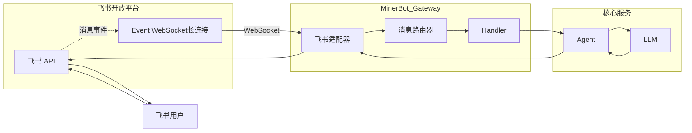

# Phase 4: 飞书适配器实施计划

## 项目背景

### 背景介绍

在前三个阶段中，我们实现了：

- **Phase 1**: Gateway 核心骨架（protocol, session, client, router）
- **Phase 2**: 请求处理器（handlers）和 WebSocket 服务器（server）
- **Phase 3**: Channel 适配器框架（base, ws, registry）

目前 Gateway 已经支持标准 WebSocket 终端（CLI、Web UI、TUI）。但在中国企业办公场景中，用户更习惯使用飞书、钉钉等 IM 工具与机器人交互。

### 本阶段目标

Phase 4 的目标是实现 **飞书适配器**，让用户可以通过飞书与 MinerBot 对话：

1. **FeishuChannel**: 飞书 WebSocket 长连接通道
2. **Token 管理**: tenant_access_token 自动刷新
3. **消息收发**: 接收飞书消息、推送回复
4. **重连机制**: 断线自动重连

### 飞书技术背景

飞书开放平台提供 **Event Subscriptions** 功能，支持两种模式：

| 模式 | 说明 | 适用场景 |
|------|------|---------|
| HTTP Webhook | 飞书主动推送消息到服务器 | 服务器有公网地址 |
| WebSocket | 建立长连接，实时接收消息 | 无公网地址/需要实时交互 |

本方案采用 **WebSocket 模式**，因为：

- 无需公网服务器
- 消息实时性更好
- 连接复用，减少 HTTP 开销

---

## 架构设计

### 飞书消息流程



### 文件结构

```
src/gateway/
├── channels/
│   ├── __init__.py       # (Phase 3)
│   ├── base.py          # (Phase 3)
│   ├── ws.py            # (Phase 3)
│   ├── feishu.py        # ★ 本阶段
│   └── dingtalk.py      # (Phase 5)
```

---

## 详细设计

### 1. FeishuChannel 核心设计

#### 1.1 初始化参数

```python
class FeishuChannel(Channel):
    """飞书 WebSocket 通道
    
    使用飞书开放平台的 Event Subscriptions WebSocket 模式。
    支持接收消息事件和推送回复。
    """
    
    def __init__(
        self,
        app_id: str,
        app_secret: str,
        verification_token: str
    ) -> None:
        super().__init__("feishu")
        self._app_id = app_id
        self._app_secret = app_secret
        self._verification_token = verification_token
        
        # 运行时状态
        self._tenant_access_token: Optional[str] = None
        self._token_expires_at: float = 0
        self._ws_client: Optional[aiohttp.ClientWebSocketResponse] = None
        self._reconnect_task: Optional[asyncio.Task] = None
        self._running = False
```

#### 1.2 生命周期

```python
async def start(self) -> None:
    """启动飞书 Channel"""
    self._running = True
    
    # 1. 获取 tenant_access_token
    await self._refresh_token()
    
    # 2. 建立 WebSocket 连接
    await self._connect_ws()
    
    # 3. 启动重连任务
    self._reconnect_task = asyncio.create_task(self._reconnect_loop())
    
    print("Feishu Channel 已启动")

async def stop(self) -> None:
    """停止飞书 Channel"""
    self._running = False
    
    # 1. 取消重连任务
    if self._reconnect_task:
        self._reconnect_task.cancel()
        try:
            await self._reconnect_task
        except asyncio.CancelledError:
            pass
    
    # 2. 关闭 WebSocket
    if self._ws_client:
        await self._ws_client.close()
        self._ws_client = None
    
    print("Feishu Channel 已停止")
```

#### 1.3 Token 管理

```python
async def _refresh_token(self) -> None:
    """刷新 tenant_access_token"""
    url = "https://open.feishu.cn/open-apis/auth/v3/tenant_access_token/internal"
    payload = {
        "app_id": self._app_id,
        "app_secret": self._app_secret
    }
    
    async with aiohttp.ClientSession() as session:
        async with session.post(url, json=payload) as resp:
            data = await resp.json()
            
            if data.get("code") != 0:
                raise RuntimeError(f"获取 token 失败: {data}")
            
            self._tenant_access_token = data["tenant_access_token"]
            # 提前 5 分钟过期，留出刷新时间
            self._token_expires_at = time.time() + data["expire"] - 300

async def _ensure_token(self) -> None:
    """确保 token 有效"""
    if time.time() >= self._token_expires_at:
        await self._refresh_token()
```

#### 1.4 WebSocket 连接

```python
async def _connect_ws(self) -> None:
    """建立 WebSocket 连接"""
    await self._ensure_token()
    
    # 获取 WebSocket URL
    url = "https://open.feishu.cn/open-apis/auth/v3/ws/connect"
    headers = {
        "Authorization": f"Bearer {self._tenant_access_token}"
    }
    
    async with aiohttp.ClientSession() as session:
        async with session.get(url, headers=headers) as resp:
            data = await resp.json()
            
            if data.get("code") != 0:
                raise RuntimeError(f"获取 WebSocket URL 失败: {data}")
            
            ws_url = data["ws_url"]
    
    # 连接 WebSocket
    async with aiohttp.ClientSession() as session:
        self._ws_client = await session.ws_connect(ws_url)
        print("飞书 WebSocket 连接已建立")
```

### 2. 消息处理

#### 2.1 消息接收

```python
async def handle_messages(self, client: Client) -> None:
    """处理飞书消息"""
    if not self._ws_client:
        return
    
    try:
        async for msg in self._ws_client:
            if not self._running:
                break
            
            if msg.type == aiohttp.WSMsgType.TEXT:
                data = msg.json()
                await self._process_event(client, data)
            
            elif msg.type == aiohttp.WSMsgType.ERROR:
                print(f"WebSocket 错误: {msg.data}")
                break
    
    except asyncio.CancelledError:
        pass
    except Exception as e:
        print(f"飞书消息处理错误: {e}")
```

#### 2.2 事件处理

```python
async def _process_event(self, client: Client, data: dict) -> None:
    """处理飞书事件"""
    event_type = data.get("type")
    
    if event_type == "url_verification":
        # URL 验证（首次配置时需要）
        await self._handle_url_verification(data)
    
    elif event_type == "event_callback":
        # 消息事件
        event = data.get("event", {})
        msg_type = event.get("msg_type")
        
        if msg_type == "text":
            # 文本消息
            content = event.get("content", {})
            text = content.get("text", "")
            message_id = event.get("message_id")
            
            # 存储 message_id 用于回复
            client.metadata["feishu_message_id"] = message_id
            
            # 转发给 Router（作为 agent.invoke）
            if self._router and client.session:
                frame = MessageFrame(
                    type=MessageType.REQ,
                    method="agent.invoke",
                    params={"message": text}
                )
                await self._router.route(client, frame)
```

#### 2.3 URL 验证

```python
async def _handle_url_verification(self, data: dict) -> None:
    """处理 URL 验证"""
    challenge = data.get("challenge")
    await self._ws_client.send_json({
        "type": "url_verification",
        "challenge": challenge
    })
```

### 3. 消息发送

#### 3.1 回复用户消息

```python
async def send_message(
    self,
    receive_id: str,
    content: str,
    msg_type: str = "text"
) -> None:
    """发送消息到飞书"""
    await self._ensure_token()
    
    url = "https://open.feishu.cn/open-apis/im/v1/messages"
    headers = {
        "Authorization": f"Bearer {self._tenant_access_token}",
        "Content-Type": "application/json; charset=utf-8"
    }
    
    payload = {
        "receive_id": receive_id,
        "msg_type": msg_type,
        "content": json.dumps({"text": content}) if msg_type == "text" else content
    }
    
    async with aiohttp.ClientSession() as session:
        async with session.post(url, json=payload, headers=headers) as resp:
            data = await resp.json()
            
            if data.get("code") != 0:
                print(f"发送消息失败: {data}")
```

### 4. 重连机制

```python
async def _reconnect_loop(self) -> None:
    """重连循环"""
    while self._running:
        try:
            await asyncio.sleep(60)  # 每分钟检查连接状态
            
            if self._ws_client.closed:
                print("飞书 WebSocket 已断开，尝试重连...")
                await self._connect_ws()
                
        except asyncio.CancelledError:
            break
        except Exception as e:
            print(f"重连错误: {e}")
            await asyncio.sleep(5)
```

---

## 实施步骤

### Step 1: 创建 FeishuChannel 骨架

1. 创建 `src/gateway/channels/feishu.py`
2. 继承 Channel 基类
3. 实现初始化参数

### Step 2: 实现 Token 管理

1. 实现 `_refresh_token()` 方法
2. 实现 `_ensure_token()` 方法
3. 测试 Token 刷新逻辑

### Step 3: 实现 WebSocket 连接

1. 实现 `_connect_ws()` 方法
2. 实现消息接收循环
3. 实现事件处理

### Step 4: 实现消息发送

1. 实现 `send_message()` 方法
2. 集成到 Handler 响应流程

### Step 5: 实现重连机制

1. 实现 `_reconnect_loop()` 方法
2. 添加自动重连逻辑
3. 测试断线重连

### Step 6: 集成测试

1. 配置飞书开发者应用
2. 测试消息收发
3. 测试重连机制

---

## 验收标准

### 功能验收

- [ ] 正确获取 tenant_access_token
- [ ] Token 过期前自动刷新
- [ ] 正确建立 WebSocket 连接
- [ ] 正确接收消息事件
- [ ] 正确回复用户消息
- [ ] 断线自动重连

### 错误处理验收

- [ ] Token 获取失败时抛出异常
- [ ] WebSocket 断开时触发重连
- [ ] 消息发送失败时记录日志

### 代码质量

- [ ] 类型注解完整
- [ ] 异常处理覆盖所有分支
- [ ] 资源正确清理

---

## 飞书配置指南

### 1. 创建应用

1. 登录 [飞书开放平台](https://open.feishu.cn/)
2. 创建企业自建应用
3. 获取 `App ID` 和 `App Secret`

### 2. 配置权限

需要以下权限：

- `im:message:send_as_bot` - 发送消息
- `im:message:receive` - 接收消息

### 3. 配置事件订阅

1. 进入应用的「事件订阅」页面
2. 添加事件：`im.message.receive_v1`
3. 订阅方式选择：**WebSocket**
4. 配置服务器地址（需可访问 `open.feishu.cn`）

### 4. 环境变量

```bash
export FEISHU_APP_ID="cli_xxxxx"
export FEISHU_APP_SECRET="xxxxx"
export FEISHU_VERIFICATION_TOKEN="xxxxx"
```

---

## 预计工作量

| 模块 | 工作内容 | 预计时间 |
|------|---------|---------|
| Token 管理 | 获取/刷新 token | 0.25 天 |
| WebSocket 连接 | 建立/维护长连接 | 0.25 天 |
| 消息收发 | 接收/发送消息 | 0.25 天 |
| 重连机制 | 断线重连 | 0.25 天 |
| **合计** | | **1 天** |

---

## 依赖关系

- **本阶段依赖**: Phase 3 (Channel 基类)
- **后续阶段依赖**: Phase 5 (钉钉), Phase 6 (配置)

---

## 附录: 与 Handler 集成

### Agent 响应自动回复

```python
# 在 AgentHandler 中，飞书响应需要特殊处理

class FeishuAgentHandler(AgentInvokeHandler):
    """飞书专用 Agent Handler"""
    
    @classmethod
    async def handle(cls, client: Client, frame: MessageFrame) -> None:
        # ... 调用 Service ...
        
        # 获取飞书 message_id
        message_id = client.metadata.get("feishu_message_id")
        
        if message_id:
            # 通过飞书 API 发送响应
            await client.channel.send_message(
                receive_id=message_id,
                content=response
            )
        else:
            # 普通 WebSocket 响应
            await client.send_response(...)
```

---

*文档版本: 1.0*
*创建时间: 2026-03-11*
*所属阶段: Phase 4*
