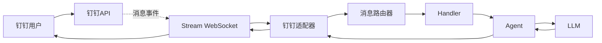

# Phase 5: 钉钉适配器实施计划

## 项目背景

### 背景介绍

在 Phase 4 中，我们已经实现了飞书适配器，让用户可以通过飞书与 MinerBot 对话。

同样在中国企业办公场景中，钉钉也是广泛使用的 IM 工具。Phase 5 的目标是实现 **钉钉适配器**。

### 本阶段目标

Phase 5 的目标是实现 **钉钉适配器**，让用户可以通过钉钉与 MinerBot 对话：

1. **DingtalkChannel**: 钉钉 Stream 模式通道
2. **签名认证**: 钉钉 API 需要 HMAC-SHA256 签名
3. **消息收发**: 接收钉钉消息、推送回复
4. **重连机制**: 断线自动重连

### 钉钉技术背景

钉钉企业机器人提供两种模式：

| 模式 | 说明 | 适用场景 |
|------|------|---------|
| 回调模式 | 钉钉主动推送消息到服务器 | 服务器有公网地址 |
| Stream 模式 | 建立 WebSocket 长连接 | 无公网地址/需要实时交互 |

本方案采用 **Stream 模式**，因为：

- 无需公网服务器
- 消息实时性更好
- 连接复用，减少 HTTP 开销

---

## 架构设计

### 钉钉消息流程



### 文件结构

```
src/gateway/
├── channels/
│   ├── __init__.py       # (Phase 3)
│   ├── base.py          # (Phase 3)
│   ├── ws.py            # (Phase 3)
│   ├── feishu.py        # (Phase 4)
│   └── dingtalk.py      # ★ 本阶段
```

---

## 详细设计

### 1. DingtalkChannel 核心设计

#### 1.1 初始化参数

```python
class DingtalkChannel(Channel):
    """钉钉 WebSocket 通道
    
    使用钉钉企业机器人的 Stream 模式（WebSocket 长连接）。
    """
    
    def __init__(
        self,
        app_key: str,
        app_secret: str
    ) -> None:
        super().__init__("dingtalk")
        self._app_key = app_key
        self._app_secret = app_secret
        
        # 运行时状态
        self._access_token: Optional[str] = None
        self._token_expires_at: float = 0
        self._ws_url: Optional[str] = None
        self._ws_client: Optional[websockets.WebSocketClientProtocol] = None
        self._reconnect_task: Optional[asyncio.Task] = None
        self._running = False
```

#### 1.2 与飞书的差异

| 特性 | 飞书 | 钉钉 |
|------|------|------|
| 认证方式 | Bearer Token | HMAC-SHA256 签名 |
| Token 类型 | tenant_access_token | access_token |
| Token 有效期 | 2 小时 | 2 小时 |
| WebSocket URL | API 获取 | 固定 URL + 签名 |
| 消息协议 | 自定义 JSON | 自定义 JSON |

---

### 2. 签名认证

#### 2.1 签名算法

钉钉使用 HMAC-SHA256 签名，算法如下：

```
timestamp = 当前时间戳(毫秒)
sign_str = timestamp + "\n" + app_secret
signature = Base64(HMAC-SHA256(sign_str))
```

#### 2.2 实现

```python
async def _refresh_token(self) -> None:
    """刷新 access_token"""
    # 签名生成
    timestamp = int(time.time() * 1000)
    secret = self._app_secret
    
    # 构造签名字符串
    sign_str = f"{timestamp}\n{secret}"
    
    # HMAC-SHA256 签名
    signature = hmac.new(
        secret.encode('utf-8'),
        sign_str.encode('utf-8'),
        hashlib.sha256
    ).digest()
    signature = base64.b64encode(signature).decode('utf-8')
    
    # 获取 access_token
    url = (f"https://api.dingtalk.com/v1.0/imbot/auth"
           f"?appkey={self._app_key}"
           f"&timestamp={timestamp}"
           f"&sign={signature}")
    
    async with aiohttp.ClientSession() as session:
        async with session.post(url) as resp:
            data = await resp.json()
            
            if data.get("code") != 0:
                raise RuntimeError(f"获取 token 失败: {data}")
            
            self._access_token = data["access_token"]
            self._token_expires_at = time.time() + 7200  # 2 小时
```

---

### 3. WebSocket 连接

#### 3.1 Stream 模式连接

钉钉 Stream 模式使用固定的 WebSocket URL，通过签名认证：

```python
async def _connect_ws(self) -> None:
    """建立 WebSocket 连接"""
    url = (f"https://api.dingtalk.com/v1.0/im/robot/oastreams/connect"
           f"?appkey={self._app_key}"
           f"&ticket=stream")
    headers = {
        "Authorization": f"Bearer {self._access_token}"
    }
    
    self._ws_client = await websockets.connect(url, extra_headers=headers)
    print("钉钉 WebSocket 连接已建立")
```

---

### 4. 消息处理

#### 4.1 消息接收

```python
async def handle_messages(self, client: Client) -> None:
    """处理钉钉消息"""
    if not self._ws_client:
        return
    
    try:
        async for message in self._ws_client:
            if not self._running:
                break
            
            data = json.loads(message)
            await self._process_event(client, data)
    
    except asyncio.CancelledError:
        pass
    except Exception as e:
        print(f"钉钉消息处理错误: {e}")
```

#### 4.2 事件处理

```python
async def _process_event(self, client: Client, data: dict) -> None:
    """处理钉钉事件"""
    event_type = data.get("EventType")
    
    if event_type == "robot":
        # 机器人消息
        msg_type = data.get("msgType")
        
        if msg_type == "text":
            content = data.get("content", "")
            sender_nick = data.get("senderNick", "")
            conversation_id = data.get("conversationId")
            
            # 存储用于回复
            client.metadata["dingtalk_conversation_id"] = conversation_id
            
            # 转发给 Router
            if self._router and client.session:
                frame = MessageFrame(
                    type=MessageType.REQ,
                    method="agent.invoke",
                    params={"message": content}
                )
                await self._router.route(client, frame)
```

---

### 5. 消息发送

#### 5.1 回复用户消息

```python
async def send_message(
    self,
    conversation_id: str,
    content: str,
    msg_type: str = "text"
) -> None:
    """发送消息到钉钉"""
    if not self._ws_client:
        return
    
    payload = {
        "msgType": msg_type,
        "content": {
            "text": content
        } if msg_type == "text" else content
    }
    
    await self._ws_client.send(json.dumps(payload))
```

---

### 6. 重连机制

```python
async def _reconnect_loop(self) -> None:
    """重连循环"""
    while self._running:
        try:
            await asyncio.sleep(60)
            
            if self._ws_client and self._ws_client.closed:
                print("钉钉 WebSocket 已断开，尝试重连...")
                await self._refresh_token()
                await self._connect_ws()
                
        except asyncio.CancelledError:
            break
        except Exception as e:
            print(f"重连错误: {e}")
            await asyncio.sleep(5)
```

---

## 实施步骤

### Step 1: 创建 DingtalkChannel 骨架

1. 创建 `src/gateway/channels/dingtalk.py`
2. 继承 Channel 基类
3. 实现初始化参数

### Step 2: 实现签名认证

1. 实现签名算法
2. 实现 `_refresh_token()` 方法
3. 测试签名认证

### Step 3: 实现 WebSocket 连接

1. 实现 `_connect_ws()` 方法
2. 实现消息接收循环
3. 实现事件处理

### Step 4: 实现消息发送

1. 实现 `send_message()` 方法
2. 集成到 Handler 响应流程

### Step 5: 实现重连机制

1. 实现 `_reconnect_loop()` 方法
2. 添加自动重连逻辑
3. 测试断线重连

### Step 6: 集成测试

1. 配置钉钉开发者应用
2. 测试消息收发
3. 测试重连机制

---

## 验收标准

### 功能验收

- [ ] 正确生成 HMAC-SHA256 签名
- [ ] 正确获取 access_token
- [ ] Token 过期前自动刷新
- [ ] 正确建立 WebSocket 连接
- [ ] 正确接收消息事件
- [ ] 正确回复用户消息
- [ ] 断线自动重连

### 错误处理验收

- [ ] 签名失败时抛出异常
- [ ] WebSocket 断开时触发重连
- [ ] 消息发送失败时记录日志

### 代码质量

- [ ] 类型注解完整
- [ ] 异常处理覆盖所有分支
- [ ] 资源正确清理

---

## 钉钉配置指南

### 1. 创建应用

1. 登录 [钉钉开放平台](https://open.dingtalk.com/)
2. 创建企业自建应用
3. 获取 `App Key` 和 `App Secret`

### 2. 配置能力

1. 进入应用的「能力管理」
2. 添加「IM」能力
3. 选择「Stream 模式」

### 3. 配置回调地址

1. 配置消息接收地址（需可访问 `api.dingtalk.com`）
2. 启用 Stream 模式

### 4. 环境变量

```bash
export DINGTALK_APP_KEY="dingxxxxx"
export DINGTALK_APP_SECRET="xxxxx"
```

---

## 预计工作量

| 模块 | 工作内容 | 预计时间 |
|------|---------|---------|
| 签名认证 | HMAC-SHA256 签名 | 0.25 天 |
| WebSocket 连接 | Stream 模式连接 | 0.25 天 |
| 消息收发 | 接收/发送消息 | 0.25 天 |
| 重连机制 | 断线重连 | 0.25 天 |
| **合计** | | **1 天** |

---

## 依赖关系

- **本阶段依赖**: Phase 3 (Channel 基类), Phase 4 (飞书适配器模式)
- **后续阶段依赖**: Phase 6 (配置)

---

## 附录: 飞书与钉钉对比

### 共同点

1. 都使用 WebSocket 长连接
2. 都支持消息收发
3. 都需要 Token 管理
4. 都需要重连机制

### 差异点

| 特性 | 飞书 | 钉钉 |
|------|------|------|
| 认证方式 | Bearer Token | HMAC-SHA256 签名 |
| Token 获取 | API 调用 | API 调用 + 签名 |
| 消息协议 | `type: event_callback` | `EventType: robot` |
| 回复方式 | HTTP API | WebSocket 直接发送 |

---

*文档版本: 1.0*
*创建时间: 2026-03-11*
*所属阶段: Phase 5*
