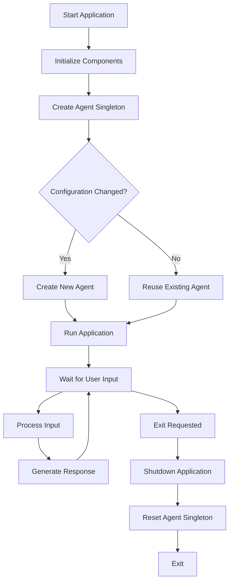
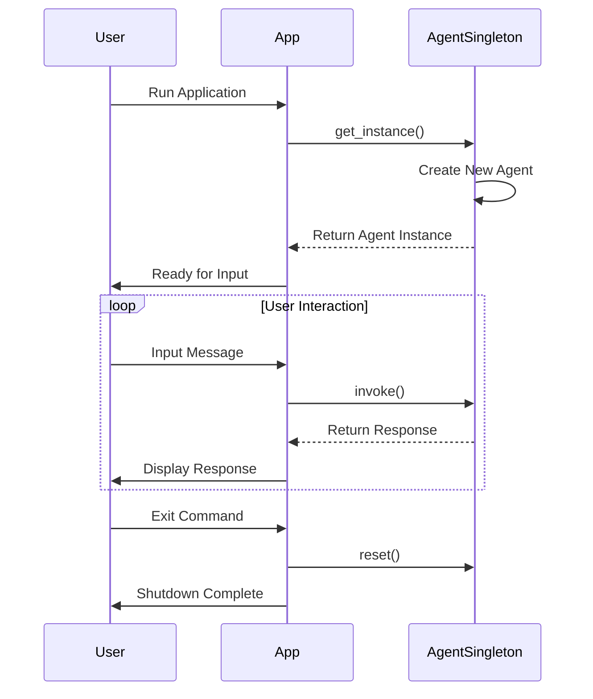

# Agent Singleton Implementation Plan

## Overview
This plan outlines the implementation of a singleton pattern for the DeepAgent instance with lifecycle management, and the creation of a main application entry point (`app.py`) to initialize and run the agent.

## Goals
1. Convert `create_agent()` to a singleton pattern
2. Implement lifecycle management for the agent instance
3. Create `app.py` as the main application entry point
4. Initialize agent singleton and run the application

## Implementation Steps

### Step 1: Modify agent.py to Singleton Pattern
```python
# src/minerbot/core/agent.py

from typing import Any, Optional, Tuple

from minerbot.models import get_model
from .config import DEFAULT_SYSTEM_PROMPT, RESEARCH_SYSTEM_PROMPT


class AgentSingleton:
    _instance: Any = None
    _config: Tuple[str, str, bool] | None = None
    
    @classmethod
    def get_instance(
        cls,
        model_name: str = "claude-sonnet-4-5-20250929",
        system_prompt: str | None = None,
        enable_search: bool = True,
    ) -> Any:
        """Get or create a singleton DeepAgent instance."""
        from deepagents import create_deep_agent
        from minerbot.tools import get_search_tool
        
        # Handle default prompt
        if system_prompt is None:
            system_prompt = DEFAULT_SYSTEM_PROMPT
        
        # Create configuration key
        new_config = (model_name, system_prompt, enable_search)
        
        # Reuse existing agent if configuration hasn't changed
        if cls._instance is not None and cls._config == new_config:
            return cls._instance
        
        # Get model
        model = get_model(model_name)
        
        # Build tools list
        tools = []
        
        if enable_search:
            search_tool = get_search_tool()
            if search_tool:
                tools.append(search_tool)
        
        # Create agent
        agent = create_deep_agent(
            model=model,
            tools=tools if tools else None,
            system_prompt=system_prompt,
        )
        
        # Update instance and configuration
        cls._instance = agent
        cls._config = new_config
        
        return agent
    
    @classmethod
    def reset(cls) -> None:
        """Reset the singleton instance."""
        cls._instance = None
        cls._config = None
    
    @classmethod
    def get_config(cls) -> Tuple[str, str, bool] | None:
        """Get current configuration."""
        return cls._config


def create_agent(
    model_name: str = "claude-sonnet-4-5-20250929",
    system_prompt: str | None = None,
    enable_search: bool = True,
) -> Any:
    """Wrapper for backward compatibility."""
    return AgentSingleton.get_instance(model_name, system_prompt, enable_search)
```

### Step 2: Create app.py Main Entry Point
```python
# src/minerbot/app.py

import sys
import asyncio
from minerbot.core.agent import AgentSingleton


class Application:
    def __init__(self):
        self.agent = None
        self.running = False
    
    async def initialize(self):
        """Initialize application components."""
        print("Initializing application...")
        
        # Initialize agent singleton
        self.agent = AgentSingleton.get_instance()
        print(f"Agent initialized with config: {AgentSingleton.get_config()}")
        
        # TODO: Initialize MessageBus
        # TODO: Initialize ChannelManager
        
        print("Application initialized successfully")
    
    async def run(self):
        """Run the application."""
        if not self.agent:
            await self.initialize()
        
        self.running = True
        print("\nAgent is ready. Type 'exit' to quit.")
        
        while self.running:
            try:
                # Get user input
                user_input = await asyncio.to_thread(input, "> ")
                
                if user_input.lower() == "exit":
                    self.running = False
                    break
                
                # Process input
                result = self.agent.invoke({"messages": [{"role": "user", "content": user_input}]})
                response = result["messages"][-1].content
                
                # Print response
                print(f"\nAgent: {response}\n")
                
            except KeyboardInterrupt:
                self.running = False
                break
        
        print("\nApplication exited")
    
    async def shutdown(self):
        """Shutdown the application."""
        print("\nShutting down application...")
        
        # Reset agent singleton
        AgentSingleton.reset()
        
        # TODO: Shutdown MessageBus
        # TODO: Shutdown ChannelManager
        
        print("Application shutdown complete")


async def main():
    app = Application()
    try:
        await app.initialize()
        await app.run()
    finally:
        await app.shutdown()


if __name__ == "__main__":
    asyncio.run(main())
```

### Step 3: Update __init__.py Exports
```python
# src/minerbot/__init__.py

from minerbot.core import create_agent, create_research_agent, chat
from minerbot.core.agent import AgentSingleton
from minerbot.app import Application

__all__ = ["create_agent", "create_research_agent", "chat", "AgentSingleton", "Application"]
```

## Lifecycle Management Flow



## Execution Order



## Testing Plan

1. **Singleton Test**:
   ```python
   agent1 = AgentSingleton.get_instance()
   agent2 = AgentSingleton.get_instance()
   assert agent1 is agent2
   ```

2. **Configuration Change Test**:
   ```python
   agent1 = AgentSingleton.get_instance(model_name="claude-sonnet-4-5-20250929")
   agent2 = AgentSingleton.get_instance(model_name="gpt-4o")
   assert agent1 is not agent2
   ```

3. **Reset Test**:
   ```python
   agent1 = AgentSingleton.get_instance()
   AgentSingleton.reset()
   agent2 = AgentSingleton.get_instance()
   assert agent1 is not agent2
   ```

## Expected Output

When running `python -m minerbot.app`:
```
Initializing application...
Agent initialized with config: ('claude-sonnet-4-5-20250929', 'You are MinerBot, a helpful AI assistant...', True)
Application initialized successfully

Agent is ready. Type 'exit' to quit.
> Hello

Agent: Hello! How can I assist you today?

> exit

Shutting down application...
Application shutdown complete
```

## Next Steps
1. Implement MessageBus component
2. Implement ChannelManager component
3. Add configuration persistence
4. Add plugin system support
5. Implement background task management